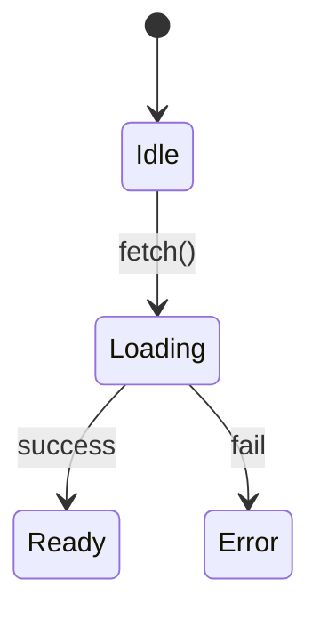

# Writing Style: AI Context Injection for Vue Components

**Audience:** AI Agent modifying Vue 3 components
**Foundation:** OpenAI + Anthropic documentation principles (how AI reads)
**Application:** vue-best-practices + antfu/skills patterns (Vue component context)

---

## Core Insight

README.md is AI's pre-loaded context before modifying a Vue component.

```
AI workflow:
  1. Read README.md → build mental model
     - Component responsibility and boundaries
     - Interface contracts (props/emits/slots)
     - Constraints and invariants
  2. Read source code → locate modification points
  3. Modify code → respect contracts and constraints
```

| Question AI needs to answer | Corresponding README structure |
|-----------------------------|-------------------------------|
| What does this component do? | Metadata + summary |
| What is the interface contract? | TypeScript interface + parameter table |
| What must not be touched? | Constraints / Anti-Patterns |
| How does state transition? | IF-THEN rules / Mermaid state diagram |
| What else will be affected? | Dependencies table |
| Am I understanding correctly? | Usage example (success + error path) |

---

## Layer 1: AI-Readable Documentation Principles (OpenAI + Anthropic)

### 1.1 Schema First

**Principle:** TypeScript interface > Table > List > Prose

```typescript
// Define exact interface (OpenAI Structured Outputs pattern)
interface Props {
  user: User
  mode: 'edit' | 'view'
  config?: ConfigOptions
}
```

Then add semantic table (Anthropic parameter table pattern):

| Prop | Type | Required | Default | Description |
|------|------|----------|---------|-------------|
| `user` | `User` | ✓ | — | User data object |
| `mode` | `'edit' \| 'view'` | ✓ | `'view'` | Display mode |

**Why:** AI parses schemas faster than prose. Both OpenAI and Anthropic use this pattern in their APIs.

### 1.2 Constraints as First-Class Citizens (RFC 2119)

**Principle:** Use MUST/MUST NOT/SHOULD keywords, no hedging

```markdown
## Constraints

**Vue reactivity invariants:**
- MUST NOT mutate props directly
- MUST NOT call async inside `computed`

**Component contracts:**
- MUST emit 'update:modelValue' when internal state changes (v-model contract)
- SHOULD debounce user input (300ms) for performance
```

**Banned words:** probably, usually, might, sometimes, generally, often, typically

❌ Constraint AI cannot execute:
```
You should probably validate the input.
```

✅ Constraint AI can precisely follow:
```
Precondition: `input.id` MUST NOT be null.
IF null → throw `ValidationError("id is required")`
```

### 1.3 Logic Formalization (Anthropic Token Efficiency)

**Principle:** Boolean expressions > Natural language

❌ "If the user is logged in and has edit permission, or is an admin, show the save button"

✅ `showSave = (isLoggedIn AND hasEditPerm) OR isAdmin`

Use Mermaid for complex state:



Enum values MUST document each value's behavior:

| Value | Behavior |
|-------|----------|
| `'edit'` | Enable form inputs, show save button |
| `'view'` | Disable inputs, hide action buttons |

**Why:** AI misinterprets natural language logic, but executes formalized rules precisely.

### 1.4 Self-Containment (Zero External Dependencies)

**Principle:** Inline all types, include all imports

❌ "See User type in types.ts"
✅ Define User inline in README

```typescript
interface User {
  id: string
  name: string
  avatar?: string
}

interface Props {
  user: User  // Type defined above, no external reference
}
```

**Why:** AI may not have access to external files when reading README.

### 1.5 Paired Examples (Success + Error)

**Principle:** Show correct usage + common mistakes

```vue
<!-- ✅ Valid -->
<UserCard :user="userData" mode="edit" />

<!-- ❌ Invalid: missing required prop -->
<UserCard mode="edit" />
// → Runtime error: user is required

<!-- ❌ Invalid: wrong type -->
<UserCard :user="null" mode="edit" />
// → Throws ValidationError
```

**Why:** AI calibrates understanding through positive/negative example pairs.

### 1.6 Token Efficiency

README consumes AI's context window. Every token MUST improve reasoning accuracy.

**Remove:**
- Narrative openings: "Welcome to...", "This component is..."
- Vague modifiers: "powerful", "elegant", "flexible"
- Transition phrases: "As mentioned above...", "It is important to note..."
- Adjectives/adverbs that don't change meaning

**Density hierarchy:** `Table` > `List` > `Paragraph`

❌ Wastes tokens:
```
There are several types of errors that can occur when using this component.
Sometimes the network fails, and other times permissions might be wrong.
```

✅ High density:

| Error | Condition | Handling |
|-------|-----------|----------|
| `NetworkError` | timeout > 5s | Retry 3× |
| `AuthError` | status 401 | Redirect `/login` |

---

## Layer 2: Vue Component Context (vue-best-practices + antfu/skills)

### 2.1 Single Responsibility Statement

**Rule:** One sentence describing the component's single responsibility. If you can't state it in one sentence → component should be split.

```markdown
# UserProfileCard

> **Responsibility**: Display user information in card layout with avatar, bio, and action buttons

NOT: "A flexible component for users"
NOT: "Handles user data, validation, and rendering"
```

### 2.2 Component Split Decision Criteria

README documents if component meets ANY split trigger:

```markdown
## Context

**Split status**: ✅ Focused (single responsibility)

Objective criteria (split if ANY is true):
- [ ] Owns both orchestration/state AND substantial UI
- [ ] Has 3+ distinct UI sections
- [ ] Contains repeated template blocks (extractable child components)
```

**Entry/root component rule:**
```
⚠️ Entry/root/view components SHOULD be composition surfaces only.
Feature implementations SHOULD NOT live in entry/root components.
```

### 2.3 Data Flow Contracts (Props Down, Events Up)

```markdown
## Data Flow

**Pattern**: Props down, Events up

Parent
  ↓ props (user, mode)
UserCard
  ↑ emits (save, cancel)
Parent

**v-model contract**:
- Receives `modelValue` prop
- Emits `update:modelValue` event
- Used as `<UserCard v-model="data" />`

**Avoid**:
- Two-way prop mutation
- provide/inject for simple parent-child communication
```

### 2.4 Composables Extraction Pattern

```markdown
## Architecture

ComponentName/
├── index.vue              # Presentational component (props in, events out)
├── composables/
│   └── useLogic.ts        # State + side effects (API calls, validation)
└── components/
    ├── Header.vue         # Reusable UI component
    └── Actions.vue        # Action buttons

**Separation of concerns**:
- `index.vue`: Template + UI orchestration
- `useLogic()`: Business logic + state management
- Child components: Focused UI sections
```

### 2.5 Reactivity Mental Model

```markdown
## State Logic

**Reactivity strategy**:
- Source state: `ref<User | null>(null)` (minimal)
- Derived state: `computed(() => user.value?.displayName)` (compute from source)
- Side effects: `watch(userId, fetchUser)` (watchers for async)

**Rules**:
- MUST keep source state minimal
- SHOULD derive everything possible with `computed`
- MUST NOT recompute expensive logic in templates
```

---

## Quality Checklist

### Layer 1: AI-Readable (OpenAI + Anthropic)
- [ ] TypeScript interface + parameter table?
- [ ] All constraints use MUST/MUST NOT keywords?
- [ ] Logic expressed as Boolean/Mermaid (not prose)?
- [ ] All types defined inline (self-contained)?
- [ ] Success + error examples paired?
- [ ] No hedging words (probably, usually, might)?
- [ ] No narrative filler (welcome, powerful, elegant)?
- [ ] Densest format used (table > list > paragraph)?

### Layer 2: Vue Context (vue-best-practices)
- [ ] Single responsibility stated in one sentence?
- [ ] Split criteria documented if applicable?
- [ ] Data flow pattern declared (props/events/v-model)?
- [ ] Composables extraction justified?
- [ ] Reactivity strategy explicit (source/derived/effects)?

### Vue-Specific
- [ ] Props/emits contracts typed with `defineProps`/`defineEmits`?
- [ ] Entry/root component status clarified?
- [ ] Enum values individually documented with behavior?
- [ ] Error paths have concrete examples?
- [ ] Each section understandable without source code?
