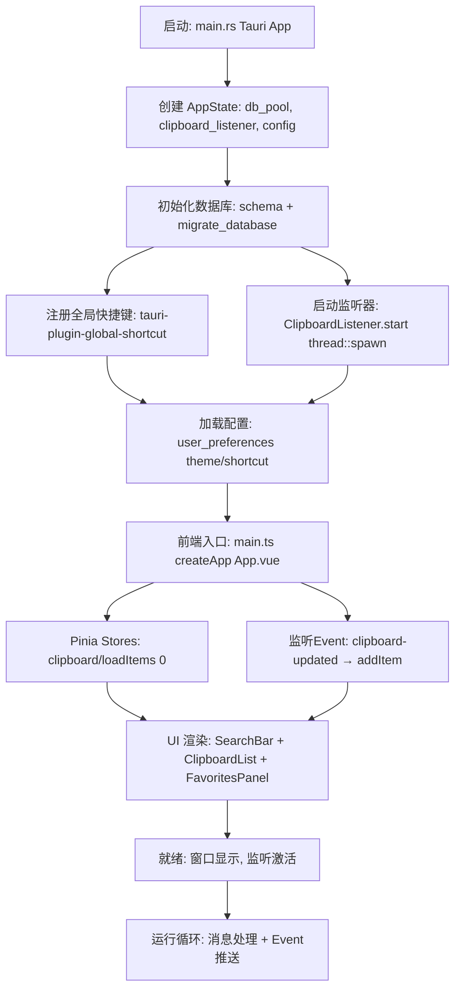
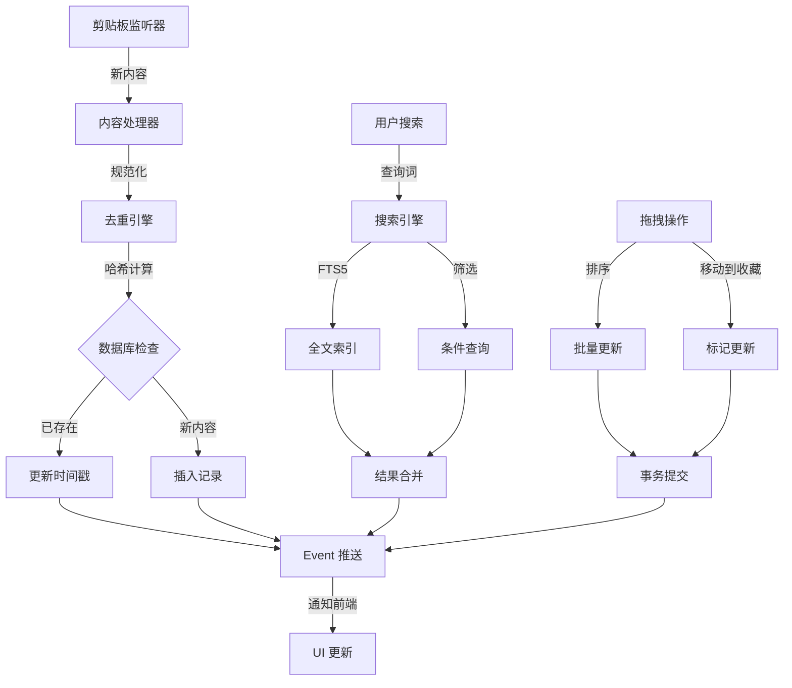
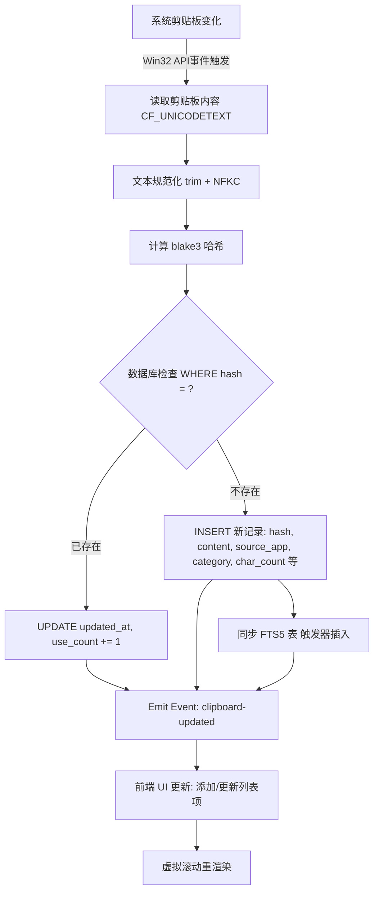
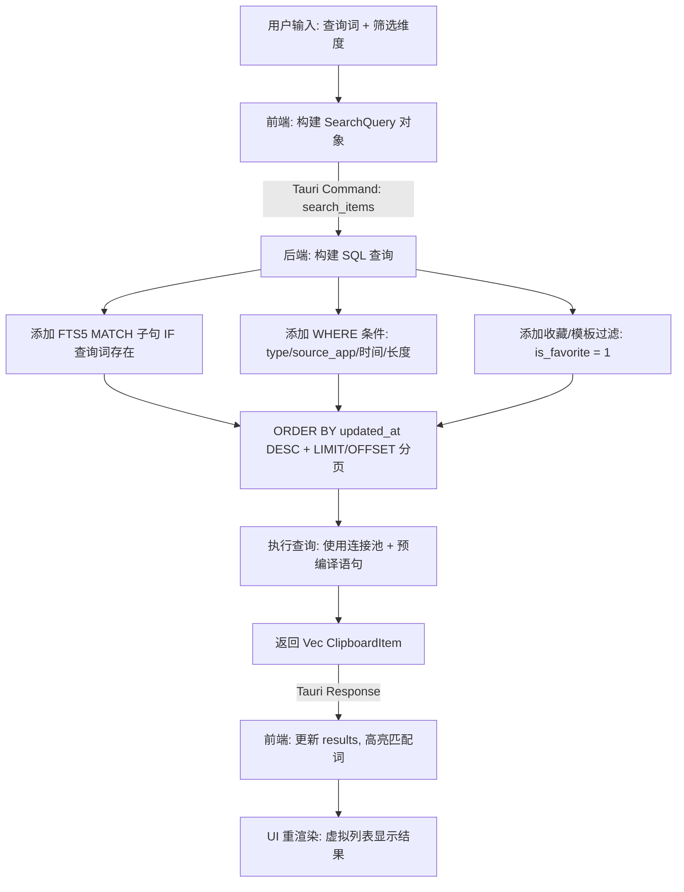
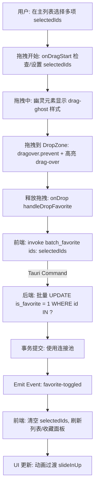
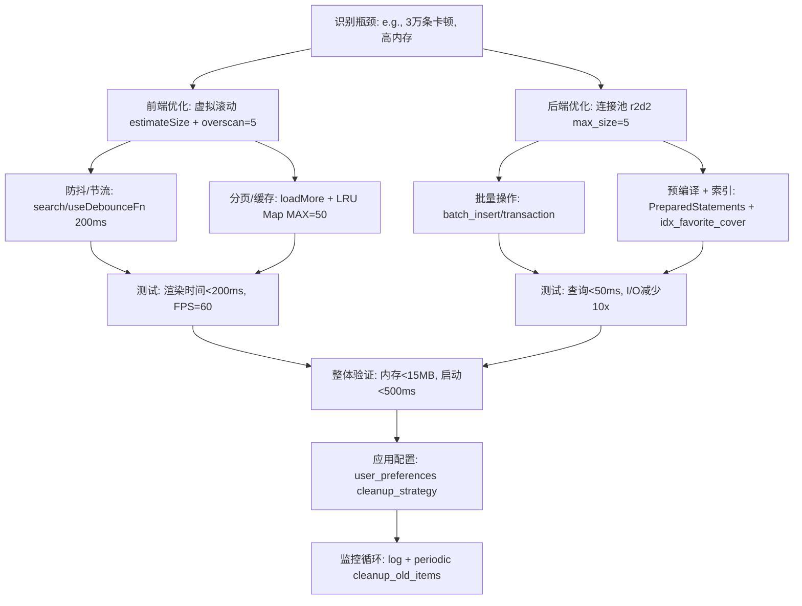
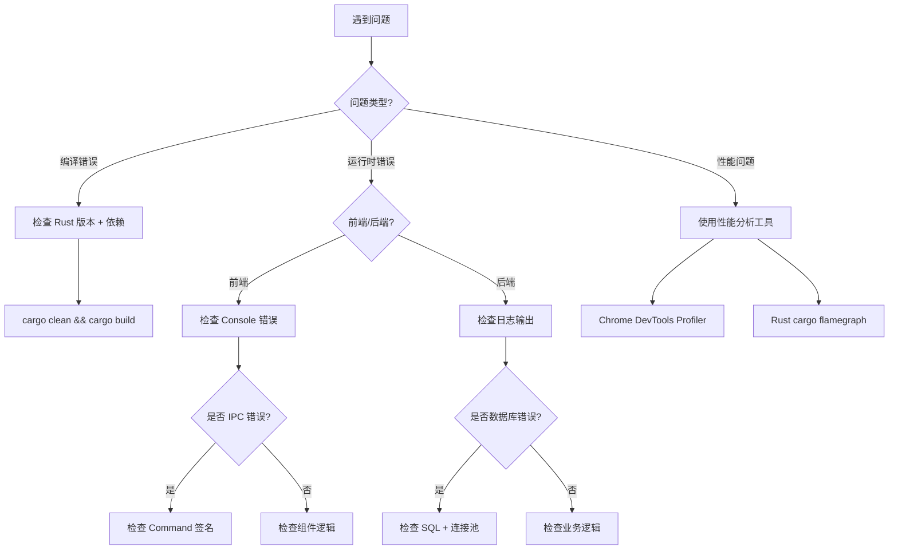

# ClipVault 完整技术方案文档 v2.0

**项目名称**：ClipVault  
**版本**：v2.0（最终方案）  
**最后更新**：2026-02-11  
**开发者**：个人开发者 + AI 辅助  
**目标定位**：极致轻量、现代化、高性能的 Windows 剪贴板管理器

---

## 📋 目录

1. [项目概述](#1-项目概述)
2. [技术选型](#2-技术选型)
3. [项目结构](#3-项目结构)
4. [理论架构](#4-理论架构)
5. [后端组成](#5-后端组成)
6. [前端组成](#6-前端组成)
7. [前后端通信](#7-前后端通信)
8. [数据库设计](#8-数据库设计)
9. [核心功能模块](#9-核心功能模块)
10. [UI/UX 设计规范](#10-uiux-设计规范)
11. [性能优化策略](#11-性能优化策略)
12. [实现阶段规划](#12-实现阶段规划)
13. [测试策略](#13-测试策略)
14. [开发指南](#14-开发指南)
15. [附录](#附录)

---

## 1. 项目概述

### 1.1 核心痛点

基于现有剪贴板工具（Ditto）的使用体验，ClipVault 解决以下问题：

| 痛点 | 现状 | ClipVault 解决方案 |
|------|------|-------------------|
| 搜索不直观 | 需要切换界面、无高亮 | 常驻搜索栏 + 即时高亮 |
| 筛选维度少 | 仅时间范围 | 类型/来源/时间/长度/标签 |
| 无收藏功能 | 无法快速访问常用内容 | 双层收藏：⭐收藏 + 📌模板 |
| 界面老旧 | Win32 原生控件 | Vercel 风格现代化 UI |
| 性能瓶颈 | 大量数据卡顿 | 虚拟滚动 + 数据库优化 |

### 1.2 核心特性

```
✅ 纯文本剪贴板监听与管理（第一版）
✅ 智能去重（blake3 哈希）
✅ 全文搜索（SQLite FTS5）
✅ 多维度筛选（类型/来源/时间/长度）
✅ 收藏与模板系统
✅ 拖拽交互（排序/批量操作/筛选器）
✅ 虚拟滚动（支持 3 万+ 条记录）
✅ 全局快捷键
✅ 来源应用检测
✅ Vercel 风格 UI（暗/亮主题）
✅ 极致性能（<10MB 内存，秒开）

🔜 后续版本：图片/富文本/文件路径支持
```

### 1.3 设计原则

- **极简主义**：最小依赖、零冗余代码
- **性能优先**：数据库索引 + 虚拟滚动 + 批量操作
- **用户体验**：流畅动画 + 直观交互 + 快捷键
- **可扩展性**：模块化设计 + 插件架构预留
- **安全性**：本地存储 + 可选加密

---

## 2. 技术选型

### 2.1 核心技术栈

| 层级 | 技术 | 版本 | 选择理由 |
|------|------|------|---------|
| **应用框架** | Tauri | 2.0 | 小体积（3-6MB）、高性能、Rust 生态、移动端扩展性 |
| **后端语言** | Rust | 1.75+ | 内存安全、并发性能、编译优化 |
| **前端框架** | Vue | 3.4+ | 轻量、响应式、组合式 API |
| **数据库** | SQLite | 3.45+ | 单文件、FTS5 全文搜索、零配置 |
| **状态管理** | Pinia | 2.1+ | 轻量、TypeScript 友好 |
| **虚拟滚动** | @tanstack/vue-virtual | 3.5+ | 动态高度支持、Headless UI |
| **拖拽交互** | vue-draggable-plus | 0.5+ | Vue 3 原生、性能优秀 |
| **哈希算法** | blake3 | 1.5+ | 速度快（1GB/s）、安全 |

### 2.2 开发工具链

```json
{
  "构建工具": "Vite 5.x",
  "CSS 框架": "UnoCSS（原子化）",
  "图标库": "@tabler/icons-vue",
  "工具函数": "@vueuse/core",
  "包管理器": "pnpm",
  "代码规范": "ESLint + Prettier + Rustfmt"
}
```

### 2.3 依赖清单

#### Rust (Cargo.toml)

```toml
[package]
name = "clipvault"
version = "2.0.0"
edition = "2021"

[dependencies]
# Tauri 核心
tauri = { version = "2.0", features = ["tray", "macos-private-api"] }
tauri-plugin-global-shortcut = "2.0"
tauri-plugin-autostart = "2.0"

# Windows API
windows = { version = "0.58", features = [
  "Win32_Foundation",
  "Win32_UI_WindowsAndMessaging",
  "Win32_System_Threading",
  "Win32_System_ProcessStatus"
]}

# 数据库
rusqlite = { version = "0.32", features = ["bundled", "modern_sqlite"] }
r2d2 = "0.8"              # 连接池
r2d2_sqlite = "0.24"

# 哈希与序列化
blake3 = "1.5"
serde = { version = "1.0", features = ["derive"] }
serde_json = "1.0"

# 并发与工具
parking_lot = "0.12"      # 高性能锁
chrono = "0.4"            # 时间处理
regex = "1.10"            # 正则匹配
unicode-normalization = "0.1"  # Unicode 规范化

[build-dependencies]
tauri-build = { version = "2.0" }
```

#### 前端 (package.json)

```json
{
  "name": "clipvault-ui",
  "version": "2.0.0",
  "type": "module",
  "scripts": {
    "dev": "vite",
    "build": "vue-tsc && vite build",
    "tauri": "tauri"
  },
  "dependencies": {
    "vue": "^3.4.21",
    "pinia": "^2.1.7",
    "@vueuse/core": "^10.9.0",
    "@tabler/icons-vue": "^2.44.0",
    "@tanstack/vue-virtual": "^3.5.0",
    "vue-draggable-plus": "^0.5.0"
  },
  "devDependencies": {
    "@tauri-apps/cli": "^2.0.0",
    "@tauri-apps/api": "^2.0.0",
    "vite": "^5.2.0",
    "unocss": "^0.58.6",
    "typescript": "^5.4.0",
    "vue-tsc": "^2.0.0",
    "@vitejs/plugin-vue": "^5.0.0"
  }
}
```

---

## 3. 项目结构

```
clipvault/
├── src-tauri/                    # Rust 后端
│   ├── src/
│   │   ├── main.rs              # 应用入口
│   │   ├── clipboard/           # 剪贴板模块
│   │   │   ├── mod.rs
│   │   │   ├── listener.rs      # 剪贴板监听器
│   │   │   └── processor.rs     # 内容处理器
│   │   ├── database/            # 数据库模块
│   │   │   ├── mod.rs
│   │   │   ├── schema.rs        # 表结构与迁移
│   │   │   ├── models.rs        # 数据模型
│   │   │   └── operations.rs    # CRUD 操作
│   │   ├── search/              # 搜索模块
│   │   │   ├── mod.rs
│   │   │   ├── engine.rs        # FTS5 搜索引擎
│   │   │   └── classifier.rs    # 内容分类器
│   │   ├── commands/            # Tauri 命令
│   │   │   ├── mod.rs
│   │   │   ├── clipboard.rs     # 剪贴板相关命令
│   │   │   ├── search.rs        # 搜索命令
│   │   │   ├── favorites.rs     # 收藏/模板命令
│   │   │   └── settings.rs      # 配置命令
│   │   ├── utils/               # 工具函数
│   │   │   ├── mod.rs
│   │   │   ├── hash.rs          # blake3 哈希
│   │   │   ├── app_detector.rs  # 来源应用检测
│   │   │   └── text_utils.rs    # 文本处理
│   │   └── state.rs             # 全局状态管理
│   ├── Cargo.toml
│   ├── build.rs
│   └── tauri.conf.json          # Tauri 配置
│
├── src/                          # Vue 前端
│   ├── assets/                   # 静态资源
│   │   ├── styles/
│   │   │   ├── main.css         # 全局样式
│   │   │   ├── vercel-theme.css # Vercel 主题
│   │   │   └── animations.css   # 动画定义
│   │   └── icons/               # SVG 图标
│   ├── components/               # Vue 组件
│   │   ├── SearchBar.vue        # 搜索栏
│   │   ├── FilterBar.vue        # 筛选器（支持拖拽排序）
│   │   ├── ClipboardList.vue    # 虚拟滚动列表
│   │   ├── ClipboardItem.vue    # 列表项
│   │   ├── FavoritesPanel.vue   # 收藏面板（拖拽排序）
│   │   ├── TemplatesPanel.vue   # 模板面板（拖拽排序）
│   │   ├── DropZone.vue         # 拖拽目标区域
│   │   ├── SettingsDialog.vue   # 设置对话框
│   │   └── TrayMenu.vue         # 托盘菜单
│   ├── composables/              # 组合式 API
│   │   ├── useClipboard.ts      # 剪贴板操作
│   │   ├── useSearch.ts         # 搜索逻辑
│   │   ├── useVirtualList.ts    # 虚拟滚动封装
│   │   ├── useDragDrop.ts       # 拖拽逻辑
│   │   └── useKeyboard.ts       # 快捷键绑定
│   ├── stores/                   # Pinia 状态
│   │   ├── clipboard.ts         # 剪贴板状态
│   │   ├── settings.ts          # 用户配置
│   │   └── ui.ts                # UI 状态
│   ├── types/                    # TypeScript 类型
│   │   ├── clipboard.ts
│   │   ├── search.ts
│   │   └── settings.ts
│   ├── utils/                    # 工具函数
│   │   ├── format.ts            # 格式化工具
│   │   ├── time.ts              # 时间处理
│   │   └── constants.ts         # 常量定义
│   ├── App.vue                   # 根组件
│   └── main.ts                   # 应用入口
│
├── public/                       # 公共资源
│   └── icons/                    # 应用图标
│       ├── icon.ico
│       └── tray-icon.png
│
├── .vscode/                      # VSCode 配置
│   └── settings.json
├── .eslintrc.json                # ESLint 配置
├── .prettierrc                   # Prettier 配置
├── tsconfig.json                 # TypeScript 配置
├── vite.config.ts                # Vite 配置
├── uno.config.ts                 # UnoCSS 配置
└── README.md                     # 项目说明
```

---

## 4. 理论架构

### 4.1 分层架构图

```
┌─────────────────────────────────────────────────────────────┐
│                      用户交互层 (UI Layer)                   │
│  ┌──────────┐  ┌──────────┐  ┌──────────┐  ┌──────────┐   │
│  │ 搜索栏   │  │ 筛选栏   │  │ 列表视图  │  │ 侧边栏   │   │
│  │ 即时搜索 │  │ 拖拽排序 │  │ 虚拟滚动  │  │ 收藏模板 │   │
│  └──────────┘  └──────────┘  └──────────┘  └──────────┘   │
│                                                              │
│  Vue 组件 + Pinia 状态管理 + @vueuse 工具                   │
└─────────────────────────────────────────────────────────────┘
                           ↕ Tauri IPC (Command/Event)
┌─────────────────────────────────────────────────────────────┐
│                   业务逻辑层 (Business Layer)                │
│  ┌──────────────┐  ┌──────────────┐  ┌──────────────┐     │
│  │ 剪贴板监听器 │  │ 搜索引擎     │  │ 分类识别器   │     │
│  │ Win32 API    │  │ FTS5 + 筛选  │  │ 正则匹配     │     │
│  └──────────────┘  └──────────────┘  └──────────────┘     │
│                                                              │
│  ┌──────────────┐  ┌──────────────┐  ┌──────────────┐     │
│  │ 去重引擎     │  │ 来源检测     │  │ 命令处理器   │     │
│  │ blake3 hash  │  │ 进程信息     │  │ Tauri Cmd    │     │
│  └──────────────┘  └──────────────┘  └──────────────┘     │
│                                                              │
│  Rust 异步运行时 + 多线程 + 连接池                          │
└─────────────────────────────────────────────────────────────┘
                           ↕ SQL / 事务
┌─────────────────────────────────────────────────────────────┐
│                   数据持久层 (Data Layer)                    │
│  ┌──────────────┐  ┌──────────────┐  ┌──────────────┐     │
│  │ clipboard_   │  │ clipboard_   │  │ user_        │     │
│  │ items        │  │ fts          │  │ preferences  │     │
│  │ (主表)       │  │ (FTS5 虚拟表)│  │ (配置表)     │     │
│  └──────────────┘  └──────────────┘  └──────────────┘     │
│                                                              │
│  SQLite 单文件数据库 + 索引优化 + 触发器同步                │
└─────────────────────────────────────────────────────────────┘
                           ↕ 系统调用
┌─────────────────────────────────────────────────────────────┐
│                  系统接口层 (System Layer)                   │
│  • Windows 剪贴板 API (CF_UNICODETEXT)                      │
│  • 全局快捷键 (RegisterHotKey)                              │
│  • 进程信息 (GetForegroundWindow, GetModuleFileNameEx)      │
│  • 系统托盘 (Shell_NotifyIcon)                              │
└─────────────────────────────────────────────────────────────┘
```

### 4.2 数据流向图

```
用户操作 → Vue 组件 → Pinia Action → Tauri Command
                                        ↓
                                   Rust Handler
                                        ↓
                              ┌─────────┴─────────┐
                              ↓                   ↓
                         数据库操作          系统 API 调用
                              ↓                   ↓
                         返回结果            返回结果
                              ↓                   ↓
                              └─────────┬─────────┘
                                        ↓
                                  Tauri Event 推送
                                        ↓
                                   Vue 监听更新
                                        ↓
                                     UI 重渲染
```

### 4.3 核心模块交互图

**应用启动与初始化流程**：


**模块交互说明**：



---

## 5. 后端组成

### 5.1 模块职责

#### 5.1.1 剪贴板监听器 (`clipboard/listener.rs`)

**职责**：
- 注册 Windows 剪贴板监听器
- 捕获剪贴板变化事件
- 读取剪贴板内容
- 检测来源应用

**关键技术**：
```rust
use windows::Win32::UI::WindowsAndMessaging::{
    AddClipboardFormatListener,
    GetClipboardData,
    CF_UNICODETEXT,
};

pub struct ClipboardListener {
    window_handle: HWND,
    tx: mpsc::Sender<ClipboardEvent>,
}

impl ClipboardListener {
    pub fn start(&self) -> Result<()> {
        // 注册监听器
        unsafe {
            AddClipboardFormatListener(self.window_handle)?;
        }
        
        // 后台线程轮询消息
        thread::spawn(move || {
            self.message_loop();
        });
        
        Ok(())
    }
    
    fn on_clipboard_change(&self) {
        let content = self.read_clipboard();
        let source_app = self.detect_source_app();
        
        self.tx.send(ClipboardEvent {
            content,
            source_app,
            timestamp: Utc::now(),
        }).ok();
    }
}
```

#### 5.1.2 内容处理器 (`clipboard/processor.rs`)

**职责**：
- 文本规范化（trim、Unicode NFKC）
- 内容分类（URL、邮箱、代码等）
- 哈希计算
- 防抖处理

**分类规则**：
```rust
pub enum ContentCategory {
    Url,        // 匹配 http(s)://
    Email,      // 匹配 xxx@xxx.xxx
    Code,       // 包含 function/class/import/const 等关键字
    Chinese,    // 中文字符占比 > 50%
    English,    // 英文字符占比 > 80%
    Mixed,      // 其他
}

impl ContentProcessor {
    pub fn classify(&self, content: &str) -> ContentCategory {
        if URL_REGEX.is_match(content) {
            return ContentCategory::Url;
        }
        if EMAIL_REGEX.is_match(content) {
            return ContentCategory::Email;
        }
        if CODE_KEYWORDS.iter().any(|kw| content.contains(kw)) {
            return ContentCategory::Code;
        }
        
        let chinese_ratio = self.chinese_char_ratio(content);
        let english_ratio = self.english_char_ratio(content);
        
        if chinese_ratio > 0.5 {
            ContentCategory::Chinese
        } else if english_ratio > 0.8 {
            ContentCategory::English
        } else {
            ContentCategory::Mixed
        }
    }
}
```

#### 5.1.3 去重引擎 (`utils/hash.rs`)

**职责**：
- 计算内容哈希（blake3）
- 数据库唯一性检查
- 决定插入或更新

**实现**：
```rust
use blake3::Hasher;

pub fn compute_hash(content: &str) -> String {
    let mut hasher = Hasher::new();
    hasher.update(content.as_bytes());
    hasher.finalize().to_hex().to_string()
}

pub async fn handle_new_content(
    db: &Pool,
    content: String,
    source_app: Option<String>,
) -> Result<ClipboardItem> {
    let normalized = normalize_text(&content);
    let hash = compute_hash(&normalized);
    
    let conn = db.get()?;
    
    // 检查是否已存在
    let existing = conn.query_row(
        "SELECT id, updated_at FROM clipboard_items WHERE hash = ?",
        params![hash],
        |row| Ok((row.get::<_, i64>(0)?, row.get::<_, i64>(1)?))
    );
    
    match existing {
        Ok((id, _)) => {
            // 更新时间戳
            conn.execute(
                "UPDATE clipboard_items SET updated_at = ?, use_count = use_count + 1 WHERE id = ?",
                params![Utc::now().timestamp(), id]
            )?;
            Ok(get_item_by_id(&conn, id)?)
        },
        Err(_) => {
            // 插入新记录
            let category = classify_content(&content);
            let char_count = content.chars().count();
            
            conn.execute(
                "INSERT INTO clipboard_items 
                 (hash, type, content, source_app, category, char_count, created_at, updated_at) 
                 VALUES (?, 'text', ?, ?, ?, ?, ?, ?)",
                params![
                    hash, content, source_app, category, char_count,
                    Utc::now().timestamp(), Utc::now().timestamp()
                ]
            )?;
            
            let id = conn.last_insert_rowid();
            Ok(get_item_by_id(&conn, id)?)
        }
    }
}
```

#### 5.1.4 搜索引擎 (`search/engine.rs`)

**职责**：
- FTS5 全文搜索
- 多条件筛选组合
- 结果排序与分页

**查询构建器**：
```rust
pub struct SearchQuery {
    pub query: Option<String>,
    pub types: Option<Vec<String>>,
    pub source_app: Option<String>,
    pub time_range: Option<TimeRange>,
    pub char_range: Option<(usize, usize)>,
    pub favorites_only: bool,
    pub templates_only: bool,
    pub page: u32,
    pub page_size: u32,
}

pub fn search_items(
    conn: &Connection,
    query: SearchQuery,
) -> Result<Vec<ClipboardItem>> {
    let mut sql = String::from("SELECT * FROM clipboard_items WHERE 1=1");
    let mut params: Vec<Box<dyn ToSql>> = Vec::new();
    
    // FTS5 全文搜索
    if let Some(q) = query.query {
        sql.push_str(" AND id IN (
            SELECT rowid FROM clipboard_fts WHERE content MATCH ?
        )");
        params.push(Box::new(format!("{}*", q)));
    }
    
    // 类型筛选
    if let Some(types) = query.types {
        let placeholders = types.iter().map(|_| "?").collect::<Vec<_>>().join(",");
        sql.push_str(&format!(" AND type IN ({})", placeholders));
        for t in types {
            params.push(Box::new(t));
        }
    }
    
    // 来源应用
    if let Some(app) = query.source_app {
        sql.push_str(" AND source_app = ?");
        params.push(Box::new(app));
    }
    
    // 时间范围
    if let Some(range) = query.time_range {
        let start = range.get_start_timestamp();
        sql.push_str(" AND created_at >= ?");
        params.push(Box::new(start));
    }
    
    // 字符数范围
    if let Some((min, max)) = query.char_range {
        sql.push_str(" AND char_count BETWEEN ? AND ?");
        params.push(Box::new(min as i64));
        params.push(Box::new(max as i64));
    }
    
    // 收藏/模板
    if query.favorites_only {
        sql.push_str(" AND is_favorite = 1");
    }
    if query.templates_only {
        sql.push_str(" AND is_template = 1");
    }
    
    // 排序与分页
    sql.push_str(" ORDER BY updated_at DESC LIMIT ? OFFSET ?");
    params.push(Box::new(query.page_size as i64));
    params.push(Box::new((query.page * query.page_size) as i64));
    
    // 执行查询
    let mut stmt = conn.prepare(&sql)?;
    let items = stmt.query_map(params.as_slice(), |row| {
        Ok(ClipboardItem::from_row(row)?)
    })?
    .collect::<Result<Vec<_>, _>>()?;
    
    Ok(items)
}
```

#### 5.1.5 Tauri 命令层 (`commands/*.rs`)

**关键命令**：

```rust
// ========== 剪贴板命令 ==========
#[tauri::command]
async fn get_items(
    state: State<'_, AppState>,
    page: u32,
    page_size: u32,
    filter: String,
) -> Result<PaginatedResult<ClipboardItem>, String> {
    // 实现分页查询
}

#[tauri::command]
async fn copy_to_clipboard(
    item_id: i64,
    state: State<'_, AppState>,
) -> Result<(), String> {
    // 复制内容到系统剪贴板
}

#[tauri::command]
async fn delete_item(
    item_id: i64,
    state: State<'_, AppState>,
) -> Result<(), String> {
    // 删除单条记录
}

// ========== 搜索命令 ==========
#[tauri::command]
async fn search_items(
    state: State<'_, AppState>,
    query: SearchQuery,
) -> Result<Vec<ClipboardItem>, String> {
    // 执行搜索
}

#[tauri::command]
async fn save_search_history(
    state: State<'_, AppState>,
    query: String,
    result_count: usize,
) -> Result<(), String> {
    // 保存搜索历史
}

// ========== 收藏/模板命令 ==========
#[tauri::command]
async fn toggle_favorite(
    item_id: i64,
    state: State<'_, AppState>,
) -> Result<(), String> {
    // 切换收藏状态
}

#[tauri::command]
async fn batch_favorite(
    ids: Vec<i64>,
    state: State<'_, AppState>,
) -> Result<(), String> {
    // 批量收藏
}

#[tauri::command]
async fn update_sort_order(
    items: Vec<SortUpdate>,
    state: State<'_, AppState>,
) -> Result<(), String> {
    // 更新排序
}

// ========== 配置命令 ==========
#[tauri::command]
async fn get_user_preference(
    key: String,
    state: State<'_, AppState>,
) -> Result<Option<String>, String> {
    // 读取配置
}

#[tauri::command]
async fn save_user_preference(
    key: String,
    value: String,
    state: State<'_, AppState>,
) -> Result<(), String> {
    // 保存配置
}
```

### 5.2 全局状态管理 (`state.rs`)

```rust
use r2d2::Pool;
use r2d2_sqlite::SqliteConnectionManager;
use parking_lot::Mutex;

pub struct AppState {
    pub db_pool: Pool<SqliteConnectionManager>,
    pub clipboard_listener: Arc<Mutex<ClipboardListener>>,
    pub config: Arc<Mutex<AppConfig>>,
}

impl AppState {
    pub fn new(db_path: &str) -> Result<Self> {
        let manager = SqliteConnectionManager::file(db_path);
        let pool = Pool::builder()
            .max_size(5)
            .build(manager)?;
        
        // 初始化数据库
        let conn = pool.get()?;
        initialize_database(&conn)?;
        
        Ok(Self {
            db_pool: pool,
            clipboard_listener: Arc::new(Mutex::new(ClipboardListener::new())),
            config: Arc::new(Mutex::new(AppConfig::load()?)),
        })
    }
}
```

---

## 6. 前端组成

### 6.1 核心组件

#### 6.1.1 主应用 (`App.vue`)

```vue
<template>
  <div class="app" :data-theme="theme">
    <!-- 标题栏（可拖动窗口） -->
    <div class="titlebar" data-tauri-drag-region>
      <div class="app-name">ClipVault</div>
      <div class="window-controls">
        <button @click="minimizeWindow">−</button>
        <button @click="closeWindow">×</button>
      </div>
    </div>

    <!-- 搜索栏 -->
    <SearchBar v-model="searchQuery" @search="handleSearch" />

    <!-- 筛选栏（支持拖拽排序） -->
    <FilterBar v-model:active="activeFilter" v-model:order="filterOrder" />

    <!-- 主内容区 -->
    <div class="main-content">
      <!-- 虚拟滚动列表 -->
      <ClipboardList
        v-if="activeView === 'list'"
        :items="filteredItems"
        :selected-ids="selectedIds"
        @select="toggleSelect"
        @copy="copyItem"
        @delete="deleteItem"
      />

      <!-- 收藏面板 -->
      <FavoritesPanel
        v-else-if="activeView === 'favorites'"
        v-model="favorites"
        @update-order="updateFavoriteOrder"
      />

      <!-- 模板面板 -->
      <TemplatesPanel
        v-else-if="activeView === 'templates'"
        v-model="templates"
        @update-order="updateTemplateOrder"
      />
    </div>

    <!-- 拖拽目标区域（批量操作） -->
    <DropZone
      v-if="selectedIds.length > 0"
      @add-to-favorites="batchFavorite"
      @add-to-templates="batchTemplate"
    />

    <!-- 状态栏 -->
    <div class="statusbar">
      <span>共 {{ totalCount }} 条</span>
      <span v-if="selectedIds.length">已选 {{ selectedIds.length }} 项</span>
      <span>最后更新 {{ relativeTime(lastUpdated) }}</span>
    </div>
  </div>
</template>

<script setup lang="ts">
import { computed, ref, onMounted } from 'vue'
import { useClipboardStore } from '@/stores/clipboard'
import { useSettingsStore } from '@/stores/settings'
import { listen } from '@tauri-apps/api/event'

const clipboardStore = useClipboardStore()
const settingsStore = useSettingsStore()

const theme = computed(() => settingsStore.theme)
const searchQuery = ref('')
const activeFilter = ref('all')
const activeView = ref('list')
const selectedIds = ref<number[]>([])

// 监听剪贴板更新事件
onMounted(async () => {
  await listen('clipboard-updated', (event) => {
    clipboardStore.addItem(event.payload)
  })
  
  // 初始加载
  await clipboardStore.loadItems(0)
})
</script>
```

#### 6.1.2 虚拟滚动列表 (`ClipboardList.vue`)

```vue
<template>
  <div ref="scrollRef" class="clipboard-list">
    <div :style="{ height: `${virtualizer.getTotalSize()}px` }">
      <div
        v-for="virtualRow in virtualizer.getVirtualItems()"
        :key="virtualRow.index"
        :style="{
          position: 'absolute',
          top: 0,
          left: 0,
          width: '100%',
          height: `${virtualRow.size}px`,
          transform: `translateY(${virtualRow.start}px)`,
        }"
      >
        <ClipboardItem
          :item="items[virtualRow.index]"
          :selected="selectedIds.includes(items[virtualRow.index].id)"
          @select="$emit('select', items[virtualRow.index].id)"
          @copy="$emit('copy', items[virtualRow.index].id)"
          @delete="$emit('delete', items[virtualRow.index].id)"
        />
      </div>
    </div>
  </div>
</template>

<script setup lang="ts">
import { ref, computed } from 'vue'
import { useVirtualizer } from '@tanstack/vue-virtual'
import ClipboardItem from './ClipboardItem.vue'

const props = defineProps<{
  items: ClipboardItem[]
  selectedIds: number[]
}>()

const scrollRef = ref<HTMLElement>()

const virtualizer = useVirtualizer({
  count: computed(() => props.items.length),
  getScrollElement: () => scrollRef.value,
  estimateSize: () => 68, // 固定高度（纯文本）
  overscan: 5, // 缓冲区
})
</script>
```

#### 6.1.3 收藏面板（拖拽排序） (`FavoritesPanel.vue`)

```vue
<template>
  <div class="favorites-panel">
    <div class="panel-header">
      <h3>⭐ 收藏 ({{ favorites.length }})</h3>
      <button @click="$emit('add')">+</button>
    </div>

    <VueDraggable
      v-model="favorites"
      handle=".drag-handle"
      animation="200"
      @end="$emit('update-order')"
    >
      <div
        v-for="item in favorites"
        :key="item.id"
        class="favorite-item"
      >
        <div class="drag-handle">⠿</div>
        <div class="content">
          <div class="preview">{{ truncate(item.content, 60) }}</div>
          <div class="meta">
            {{ relativeTime(item.created_at) }} · {{ item.char_count }} 字符
          </div>
        </div>
        <div class="actions">
          <button @click="copyItem(item.id)">
            <IconCopy />
          </button>
          <button @click="removeFavorite(item.id)" class="danger">
            <IconTrash />
          </button>
        </div>
      </div>
    </VueDraggable>
  </div>
</template>

<script setup lang="ts">
import { VueDraggable } from 'vue-draggable-plus'
import { IconCopy, IconTrash } from '@tabler/icons-vue'

const props = defineProps<{
  modelValue: ClipboardItem[]
}>()

const emit = defineEmits<{
  'update:modelValue': [items: ClipboardItem[]]
  'update-order': []
}>()

const favorites = computed({
  get: () => props.modelValue,
  set: (value) => emit('update:modelValue', value),
})
</script>
```

### 6.2 Composables（组合式 API）

#### 6.2.1 剪贴板操作 (`useClipboard.ts`)

```typescript
import { invoke } from '@tauri-apps/api/core'
import { useClipboardStore } from '@/stores/clipboard'

export function useClipboard() {
  const store = useClipboardStore()

  const copyItem = async (id: number) => {
    await invoke('copy_to_clipboard', { itemId: id })
    // 更新使用次数
    await invoke('increment_use_count', { itemId: id })
    store.updateItem(id)
  }

  const deleteItem = async (id: number) => {
    await invoke('delete_item', { itemId: id })
    store.removeItem(id)
  }

  const toggleFavorite = async (id: number) => {
    await invoke('toggle_favorite', { itemId: id })
    store.updateItem(id)
  }

  return {
    copyItem,
    deleteItem,
    toggleFavorite,
  }
}
```

#### 6.2.2 搜索逻辑 (`useSearch.ts`)

```typescript
import { ref, computed } from 'vue'
import { invoke } from '@tauri-apps/api/core'
import { useDebounceFn } from '@vueuse/core'

export function useSearch() {
  const query = ref('')
  const filters = ref({
    types: [],
    sourceApp: null,
    timeRange: null,
    charRange: null,
  })
  const results = ref<ClipboardItem[]>([])
  const isSearching = ref(false)

  const search = useDebounceFn(async () => {
    if (!query.value && !hasActiveFilters.value) {
      results.value = []
      return
    }

    isSearching.value = true
    try {
      results.value = await invoke('search_items', {
        query: {
          query: query.value || null,
          ...filters.value,
          page: 0,
          pageSize: 100,
        },
      })
    } finally {
      isSearching.value = false
    }
  }, 200)

  const hasActiveFilters = computed(() => {
    return filters.value.types.length > 0 ||
           filters.value.sourceApp !== null ||
           filters.value.timeRange !== null ||
           filters.value.charRange !== null
  })

  return {
    query,
    filters,
    results,
    isSearching,
    search,
    hasActiveFilters,
  }
}
```

### 6.3 Pinia Stores

#### 6.3.1 剪贴板状态 (`stores/clipboard.ts`)

```typescript
import { defineStore } from 'pinia'
import { invoke } from '@tauri-apps/api/core'

export const useClipboardStore = defineStore('clipboard', {
  state: () => ({
    items: [] as ClipboardItem[],
    favorites: [] as ClipboardItem[],
    templates: [] as ClipboardItem[],
    selectedIds: [] as number[],
    totalCount: 0,
    currentPage: 0,
    hasMore: true,
  }),

  actions: {
    async loadItems(page: number = 0) {
      const result = await invoke<PaginatedResult<ClipboardItem>>('get_items', {
        page,
        pageSize: 100,
        filter: 'all',
      })

      if (page === 0) {
        this.items = result.items
      } else {
        this.items.push(...result.items)
      }

      this.totalCount = result.total
      this.hasMore = result.items.length === 100
      this.currentPage = page
    },

    async loadFavorites() {
      this.favorites = await invoke('get_favorites')
    },

    async loadTemplates() {
      this.templates = await invoke('get_templates')
    },

    async batchFavorite() {
      await invoke('batch_favorite', { ids: this.selectedIds })
      this.selectedIds = []
      await this.loadItems(0)
      await this.loadFavorites()
    },

    async updateFavoriteOrder() {
      await invoke('batch_update_sort', {
        items: this.favorites.map((item, index) => ({
          id: item.id,
          sortOrder: index,
        })),
      })
    },

    addItem(item: ClipboardItem) {
      // 检查是否已存在
      const existingIndex = this.items.findIndex(i => i.hash === item.hash)
      if (existingIndex > -1) {
        // 移到最前面
        this.items.splice(existingIndex, 1)
      }
      this.items.unshift(item)
      this.totalCount++
    },

    removeItem(id: number) {
      const index = this.items.findIndex(i => i.id === id)
      if (index > -1) {
        this.items.splice(index, 1)
        this.totalCount--
      }
    },
  },
})
```

---

## 7. 前后端通信

### 7.1 Tauri IPC 机制

#### 7.1.1 Command（前端 → 后端）

**特点**：
- 同步/异步调用
- 类型安全（TypeScript + Rust）
- 返回值序列化

**示例**：
```typescript
// 前端调用
const items = await invoke<ClipboardItem[]>('get_items', {
  page: 0,
  pageSize: 100,
})
```

```rust
// 后端处理
#[tauri::command]
async fn get_items(
    page: u32,
    page_size: u32,
) -> Result<Vec<ClipboardItem>, String> {
    // 实现逻辑
}
```

#### 7.1.2 Event（后端 → 前端）

**特点**：
- 实时推送
- 广播模式
- 用于状态更新

**示例**：
```rust
// 后端发送
window.emit("clipboard-updated", &new_item)?;
```

```typescript
// 前端监听
import { listen } from '@tauri-apps/api/event'

await listen<ClipboardItem>('clipboard-updated', (event) => {
  clipboardStore.addItem(event.payload)
})
```

### 7.2 通信协议设计

#### 7.2.1 命令列表

| 命令名 | 参数 | 返回值 | 说明 |
|--------|------|--------|------|
| `get_items` | `page, page_size, filter` | `PaginatedResult<ClipboardItem>` | 分页获取列表 |
| `search_items` | `SearchQuery` | `Vec<ClipboardItem>` | 搜索 |
| `copy_to_clipboard` | `item_id` | `()` | 复制到剪贴板 |
| `delete_item` | `item_id` | `()` | 删除 |
| `batch_delete` | `ids: Vec<i64>` | `()` | 批量删除 |
| `toggle_favorite` | `item_id` | `()` | 切换收藏 |
| `batch_favorite` | `ids: Vec<i64>` | `()` | 批量收藏 |
| `batch_template` | `ids: Vec<i64>` | `()` | 批量模板 |
| `batch_update_sort` | `items: Vec<SortUpdate>` | `()` | 更新排序 |
| `get_favorites` | - | `Vec<ClipboardItem>` | 获取收藏 |
| `get_templates` | - | `Vec<ClipboardItem>` | 获取模板 |
| `get_user_preference` | `key: String` | `Option<String>` | 读取配置 |
| `save_user_preference` | `key, value` | `()` | 保存配置 |
| `cleanup_old_items` | - | `usize` | 清理旧数据 |

#### 7.2.2 事件列表

| 事件名 | Payload | 触发时机 |
|--------|---------|---------|
| `clipboard-updated` | `ClipboardItem` | 新内容添加 |
| `item-deleted` | `{ id: number }` | 项目被删除 |
| `favorite-toggled` | `{ id: number, is_favorite: boolean }` | 收藏状态变化 |
| `settings-changed` | `{ key: string, value: any }` | 配置更新 |

### 7.3 类型定义（TypeScript ↔ Rust）

```typescript
// types/clipboard.ts
export interface ClipboardItem {
  id: number
  hash: string
  type: 'text' | 'image' | 'richtext' | 'filepath' | 'markdown'
  content: string
  metadata?: any
  source_app?: string
  category?: string
  char_count: number
  created_at: number
  updated_at: number
  is_favorite: boolean
  is_template: boolean
  sort_order: number
  use_count: number
  tags?: string[]
}

export interface SearchQuery {
  query?: string
  types?: string[]
  source_app?: string
  time_range?: TimeRange
  char_range?: [number, number]
  favorites_only?: boolean
  templates_only?: boolean
  page: number
  page_size: number
}

export interface PaginatedResult<T> {
  items: T[]
  total: number
  page: number
  page_size: number
}
```

```rust
// database/models.rs
use serde::{Deserialize, Serialize};

#[derive(Debug, Clone, Serialize, Deserialize)]
pub struct ClipboardItem {
    pub id: i64,
    pub hash: String,
    #[serde(rename = "type")]
    pub item_type: String,
    pub content: String,
    pub metadata: Option<String>,
    pub source_app: Option<String>,
    pub category: Option<String>,
    pub char_count: i64,
    pub created_at: i64,
    pub updated_at: i64,
    pub is_favorite: bool,
    pub is_template: bool,
    pub sort_order: i64,
    pub use_count: i64,
    pub tags: Option<String>,
}

#[derive(Debug, Deserialize)]
pub struct SearchQuery {
    pub query: Option<String>,
    pub types: Option<Vec<String>>,
    pub source_app: Option<String>,
    pub time_range: Option<TimeRange>,
    pub char_range: Option<(usize, usize)>,
    pub favorites_only: Option<bool>,
    pub templates_only: Option<bool>,
    pub page: u32,
    pub page_size: u32,
}
```

---

## 8. 数据库设计

### 8.1 完整 Schema

```sql
-- ========================================
-- 主表：clipboard_items
-- ========================================
CREATE TABLE IF NOT EXISTS clipboard_items (
    -- 主键
    id INTEGER PRIMARY KEY AUTOINCREMENT,
    
    -- 去重哈希
    hash TEXT NOT NULL UNIQUE,
    
    -- 内容类型（text/image/richtext/filepath/markdown）
    type TEXT NOT NULL DEFAULT 'text',
    
    -- 核心内容
    content TEXT NOT NULL,
    
    -- 扩展数据（JSON）
    -- 示例：{"image_path": "/tmp/xxx.png", "width": 1920, "height": 1080}
    metadata TEXT,
    
    -- 分类与来源
    source_app TEXT,           -- 来源应用（VSCode/Chrome/Word）
    category TEXT,             -- 自动分类（url/email/code/chinese/english）
    char_count INTEGER,        -- 字符数
    
    -- 时间戳
    created_at INTEGER NOT NULL,   -- 首次创建时间
    updated_at INTEGER NOT NULL,   -- 最后使用时间
    
    -- 标记
    is_favorite INTEGER DEFAULT 0,  -- 是否收藏（0/1）
    is_template INTEGER DEFAULT 0,  -- 是否模板（0/1）
    tags TEXT,                      -- 标签（JSON 数组）
    
    -- 排序
    sort_order INTEGER DEFAULT 0,   -- 手动排序（0=自动，>0=手动）
    
    -- 统计
    use_count INTEGER DEFAULT 1     -- 使用次数
);

-- ========================================
-- 索引（性能优化）
-- ========================================
CREATE INDEX IF NOT EXISTS idx_updated_at 
    ON clipboard_items(updated_at DESC);

CREATE INDEX IF NOT EXISTS idx_type_updated 
    ON clipboard_items(type, updated_at DESC);

CREATE INDEX IF NOT EXISTS idx_favorite_sort 
    ON clipboard_items(is_favorite, sort_order ASC, updated_at DESC);

CREATE INDEX IF NOT EXISTS idx_template_sort 
    ON clipboard_items(is_template, sort_order ASC, updated_at DESC);

CREATE INDEX IF NOT EXISTS idx_source_app 
    ON clipboard_items(source_app);

CREATE INDEX IF NOT EXISTS idx_category 
    ON clipboard_items(category);

CREATE INDEX IF NOT EXISTS idx_char_count 
    ON clipboard_items(char_count);

-- ========================================
-- FTS5 全文搜索虚拟表
-- ========================================
CREATE VIRTUAL TABLE IF NOT EXISTS clipboard_fts USING fts5(
    content,
    tokenize = 'unicode61 remove_diacritics 2'
);

-- ========================================
-- 触发器（自动同步 FTS）
-- ========================================
CREATE TRIGGER IF NOT EXISTS clipboard_items_ai 
AFTER INSERT ON clipboard_items
BEGIN
    INSERT INTO clipboard_fts(rowid, content) 
    VALUES (new.id, new.content);
END;

CREATE TRIGGER IF NOT EXISTS clipboard_items_au 
AFTER UPDATE ON clipboard_items
BEGIN
    UPDATE clipboard_fts 
    SET content = new.content 
    WHERE rowid = old.id;
END;

CREATE TRIGGER IF NOT EXISTS clipboard_items_ad 
AFTER DELETE ON clipboard_items
BEGIN
    DELETE FROM clipboard_fts 
    WHERE rowid = old.id;
END;

-- ========================================
-- 用户配置表
-- ========================================
CREATE TABLE IF NOT EXISTS user_preferences (
    key TEXT PRIMARY KEY,
    value TEXT NOT NULL,       -- JSON 格式
    updated_at INTEGER NOT NULL
);

-- 预置默认配置
INSERT OR IGNORE INTO user_preferences (key, value, updated_at) VALUES
('filter_order', '["all","today","favorite","template"]', unixepoch()),
('cleanup_strategy', '{"type":"count","max_items":30000}', unixepoch()),
('theme', '"vercel-dark"', unixepoch()),
('shortcut_show', '"Ctrl+Shift+V"', unixepoch()),
('shortcut_template', '"Ctrl+Shift+T"', unixepoch());

-- ========================================
-- 搜索历史表
-- ========================================
CREATE TABLE IF NOT EXISTS search_history (
    id INTEGER PRIMARY KEY AUTOINCREMENT,
    query TEXT NOT NULL,
    filters TEXT,              -- JSON 格式的筛选条件
    result_count INTEGER,
    timestamp INTEGER NOT NULL
);

CREATE INDEX IF NOT EXISTS idx_search_timestamp 
    ON search_history(timestamp DESC);

-- ========================================
-- 数据库版本控制
-- ========================================
CREATE TABLE IF NOT EXISTS schema_version (
    version INTEGER PRIMARY KEY,
    applied_at INTEGER NOT NULL
);

INSERT OR IGNORE INTO schema_version (version, applied_at) 
VALUES (1, unixepoch());
```

### 8.2 查询优化示例

#### 8.2.1 获取收藏列表（按手动排序）

```sql
SELECT * FROM clipboard_items 
WHERE is_favorite = 1 
ORDER BY sort_order ASC, updated_at DESC;
```

**优化点**：
- 使用 `idx_favorite_sort` 复合索引
- 避免全表扫描

#### 8.2.2 全文搜索 + 筛选组合

```sql
SELECT c.* FROM clipboard_items c
JOIN clipboard_fts f ON c.id = f.rowid
WHERE f.content MATCH '搜索词*'
  AND c.type = 'text'
  AND c.source_app = 'VSCode'
  AND c.created_at >= 1707523200
ORDER BY c.updated_at DESC
LIMIT 100;
```

**优化点**：
- FTS5 索引快速定位
- 类型和来源通过索引过滤
- LIMIT 限制结果集大小

#### 8.2.3 批量更新排序

```sql
BEGIN;
UPDATE clipboard_items SET sort_order = 0 WHERE id = 123;
UPDATE clipboard_items SET sort_order = 1 WHERE id = 456;
UPDATE clipboard_items SET sort_order = 2 WHERE id = 789;
COMMIT;
```

**优化点**：
- 使用事务减少磁盘 I/O
- 批量操作性能提升 10 倍+

### 8.3 数据迁移机制

```rust
pub fn migrate_database(conn: &Connection) -> Result<()> {
    let current_version = get_schema_version(conn)?;
    
    if current_version < 2 {
        // 迁移到版本 2
        conn.execute_batch(r#"
            ALTER TABLE clipboard_items ADD COLUMN tags TEXT;
            UPDATE schema_version SET version = 2;
        "#)?;
    }
    
    if current_version < 3 {
        // 迁移到版本 3
        conn.execute_batch(r#"
            CREATE INDEX idx_tags ON clipboard_items(tags);
            UPDATE schema_version SET version = 3;
        "#)?;
    }
    
    Ok(())
}
```

---

## 9. 核心功能模块

### 9.1 剪贴板监听与去重

**流程图**：


**关键代码**：
```rust
async fn handle_clipboard_change(
    window: &Window,
    db: &Pool,
    content: String,
    source_app: Option<String>,
) -> Result<()> {
    let normalized = normalize_text(&content);
    let hash = compute_hash(&normalized);
    let category = classify_content(&content);
    let char_count = content.chars().count() as i64;
    
    let conn = db.get()?;
    
    // 尝试更新
    let updated = conn.execute(
        "UPDATE clipboard_items 
         SET updated_at = ?, use_count = use_count + 1 
         WHERE hash = ?",
        params![Utc::now().timestamp(), hash]
    )?;
    
    let item = if updated == 0 {
        // 插入新记录
        conn.execute(
            "INSERT INTO clipboard_items 
             (hash, type, content, source_app, category, char_count, created_at, updated_at) 
             VALUES (?, 'text', ?, ?, ?, ?, ?, ?)",
            params![
                hash, content, source_app, category, char_count,
                Utc::now().timestamp(), Utc::now().timestamp()
            ]
        )?;
        
        get_item_by_id(&conn, conn.last_insert_rowid())?
    } else {
        // 获取更新后的记录
        get_item_by_hash(&conn, &hash)?
    };
    
    // 通知前端
    window.emit("clipboard-updated", &item)?;
    
    Ok(())
}
```

**潜在优化与风险**：

| 优化点 | 说明 | 实现优先级 |
|--------|------|-----------|
| 防抖处理 | 连续快速复制时，添加 200ms 防抖窗口 | P0（必需） |
| 内容长度限制 | 单条内容限制 10KB，避免过长文本 | P0 |
| 敏感内容过滤 | 可选：自动检测密码格式并排除 | P2（可选） |
| 错误恢复 | 数据库错误时记录日志，不中断监听 | P1（重要） |

**错误处理机制**：
```rust
// 防抖处理
static LAST_HASH: Lazy<Mutex<Option<String>>> = Lazy::new(|| Mutex::new(None));
static LAST_TIME: Lazy<Mutex<i64>> = Lazy::new(|| Mutex::new(0));

fn should_process_clipboard(hash: &str) -> bool {
    let mut last_hash = LAST_HASH.lock();
    let mut last_time = LAST_TIME.lock();
    let now = Utc::now().timestamp_millis();
    
    // 相同内容且间隔 < 200ms，忽略
    if let Some(prev_hash) = last_hash.as_ref() {
        if prev_hash == hash && now - *last_time < 200 {
            return false;
        }
    }
    
    *last_hash = Some(hash.to_string());
    *last_time = now;
    true
}

// 错误恢复
async fn clipboard_listener_loop(window: Window, db: Pool) {
    loop {
        match read_clipboard_content() {
            Ok(content) => {
                let hash = compute_hash(&normalize_text(&content));
                if should_process_clipboard(&hash) {
                    if let Err(e) = handle_clipboard_change(&window, &db, content, None).await {
                        error!("处理剪贴板内容失败: {}", e);
                        // 不中断循环，继续监听
                    }
                }
            }
            Err(e) => {
                warn!("读取剪贴板失败: {}", e);
                // 等待一段时间后重试
                tokio::time::sleep(Duration::from_millis(100)).await;
            }
        }
    }
}
```

### 9.2 多维搜索与筛选

**流程图**：


**支持的筛选维度**：
1. **关键词搜索**：FTS5 全文匹配（支持前缀、模糊）
2. **内容类型**：text/image/richtext/filepath/markdown
3. **来源应用**：VSCode/Chrome/Word 等
4. **时间范围**：今天/本周/本月/自定义
5. **内容长度**：短文本（<100）/中等（100-500）/长文本（>500）
6. **收藏/模板**：布尔筛选
7. **标签**：JSON 数组匹配（未来）

**前端筛选器 UI**：
```vue
<template>
  <div class="filter-bar">
    <!-- 快捷筛选（可拖拽排序） -->
    <VueDraggable
      v-model="filterOrder"
      animation="150"
      @end="saveFilterOrder"
    >
      <button
        v-for="filter in orderedFilters"
        :key="filter.id"
        :class="{ active: activeFilter === filter.id }"
        @click="applyFilter(filter)"
      >
        {{ filter.icon }} {{ filter.label }}
      </button>
    </VueDraggable>

    <!-- 高级筛选按钮 -->
    <button @click="showAdvancedFilters = true">
      <IconFilter /> 更多筛选
    </button>
  </div>

  <!-- 高级筛选抽屉 -->
  <Transition name="slide">
    <div v-if="showAdvancedFilters" class="advanced-filters">
      <h3>高级筛选</h3>
      
      <div class="filter-group">
        <label>内容类型</label>
        <div class="checkbox-group">
          <label v-for="type in contentTypes" :key="type">
            <input type="checkbox" v-model="filters.types" :value="type">
            {{ type }}
          </label>
        </div>
      </div>

      <div class="filter-group">
        <label>来源应用</label>
        <select v-model="filters.sourceApp">
          <option :value="null">全部</option>
          <option v-for="app in sourceApps" :key="app">{{ app }}</option>
        </select>
      </div>

      <div class="filter-group">
        <label>时间范围</label>
        <input type="date" v-model="filters.startDate">
        <span>至</span>
        <input type="date" v-model="filters.endDate">
      </div>

      <div class="filter-group">
        <label>内容长度</label>
        <div class="radio-group">
          <label>
            <input type="radio" v-model="filters.lengthRange" value="all">
            全部
          </label>
          <label>
            <input type="radio" v-model="filters.lengthRange" value="short">
            短文本 (&lt;100)
          </label>
          <label>
            <input type="radio" v-model="filters.lengthRange" value="long">
            长文本 (&gt;500)
          </label>
        </div>
      </div>

      <div class="actions">
        <button @click="applyFilters">应用筛选</button>
        <button @click="resetFilters">重置</button>
      </div>
    </div>
  </Transition>
</template>
```

### 9.3 拖拽交互系统

**批量拖拽到收藏流程图**：


#### 9.3.1 场景 1：收藏/模板列表排序

```vue
<template>
  <VueDraggable
    v-model="items"
    handle=".drag-handle"
    animation="200"
    ghost-class="ghost"
    drag-class="dragging"
    @start="onDragStart"
    @end="onDragEnd"
  >
    <div v-for="item in items" :key="item.id" class="draggable-item">
      <div class="drag-handle">⠿</div>
      <div class="content">{{ item.content }}</div>
    </div>
  </VueDraggable>
</template>

<script setup lang="ts">
const onDragEnd = async () => {
  // 批量更新排序
  await invoke('batch_update_sort', {
    items: items.value.map((item, index) => ({
      id: item.id,
      sortOrder: index,
    })),
  })
}
</script>

<style scoped>
.ghost {
  opacity: 0.5;
  background: var(--bg-hover);
}

.dragging {
  opacity: 0.9;
  transform: rotate(2deg);
}
</style>
```

#### 9.3.2 场景 2：批量拖拽到收藏

```vue
<template>
  <div class="batch-drag-container">
    <!-- 主列表（拖拽源） -->
    <div class="items-list">
      <div
        v-for="item in items"
        :key="item.id"
        :class="{ selected: selectedIds.includes(item.id) }"
        draggable="true"
        @dragstart="onDragStart(item)"
      >
        <input type="checkbox" v-model="selectedIds" :value="item.id">
        {{ item.content }}
      </div>
    </div>

    <!-- 拖拽目标区域 -->
    <div class="drop-zones">
      <div
        class="drop-zone"
        :class="{ 'drag-over': dragOverFavorite }"
        @dragover.prevent="dragOverFavorite = true"
        @dragleave="dragOverFavorite = false"
        @drop="handleDropFavorite"
      >
        ⭐ 拖拽到此处添加收藏
      </div>

      <div
        class="drop-zone"
        :class="{ 'drag-over': dragOverTemplate }"
        @dragover.prevent="dragOverTemplate = true"
        @dragleave="dragOverTemplate = false"
        @drop="handleDropTemplate"
      >
        📌 拖拽到此处创建模板
      </div>
    </div>
  </div>
</template>

<script setup lang="ts">
const onDragStart = (item: ClipboardItem) => {
  // 如果拖拽的项未选中，只拖拽该项
  if (!selectedIds.value.includes(item.id)) {
    selectedIds.value = [item.id]
  }
}

const handleDropFavorite = async (e: DragEvent) => {
  e.preventDefault()
  dragOverFavorite.value = false
  
  await invoke('batch_favorite', { ids: selectedIds.value })
  selectedIds.value = []
  // 刷新列表
}

const handleDropTemplate = async (e: DragEvent) => {
  e.preventDefault()
  dragOverTemplate.value = false
  
  await invoke('batch_template', { ids: selectedIds.value })
  selectedIds.value = []
}
</script>
```

#### 9.3.3 场景 3：筛选器顺序调整

```vue
<template>
  <VueDraggable
    v-model="filters"
    animation="150"
    @end="saveFilterOrder"
  >
    <button
      v-for="filter in filters"
      :key="filter.id"
      :class="{ active: activeFilter === filter.id }"
      @click="applyFilter(filter)"
    >
      {{ filter.icon }} {{ filter.label }}
    </button>
  </VueDraggable>
</template>

<script setup lang="ts">
const saveFilterOrder = async () => {
  const order = filters.value.map(f => f.id)
  await invoke('save_user_preference', {
    key: 'filter_order',
    value: JSON.stringify(order),
  })
}
</script>
```

### 9.4 虚拟滚动性能优化

**关键参数**：
```typescript
const virtualizer = useVirtualizer({
  count: items.length,
  getScrollElement: () => scrollRef.value,
  
  // 高度估算（动态高度支持）
  estimateSize: (index) => {
    const item = items[index]
    if (item.type === 'text') {
      // 根据字符数动态计算
      const lines = Math.ceil(item.char_count / 60)
      return Math.min(lines * 20 + 48, 200) // 最小68px，最大200px
    }
    return 68 // 默认高度
  },
  
  // 真实高度测量（重要！）
  measureElement: (element) => element.getBoundingClientRect().height,
  
  // 缓冲区（上下各5个）
  overscan: 5,
  
  // 滚动平滑
  scrollPaddingStart: 0,
  scrollPaddingEnd: 0,
})
```

**性能对比**：
| 指标 | 传统渲染（3万条） | 虚拟滚动 |
|------|------------------|---------|
| 初始渲染时间 | 5-10s | <200ms |
| DOM 节点数 | 30000 | 18（可见+缓冲） |
| 内存占用 | ~300MB | ~15MB |
| 滚动帧率 | 10-20 fps | 60 fps |

---

## 10. UI/UX 设计规范

### 10.1 Vercel 风格配色

```css
:root {
  /* ========== 暗色主题（默认） ========== */
  --bg-primary: #000000;
  --bg-secondary: #111111;
  --bg-tertiary: #1a1a1a;
  --bg-hover: #222222;
  
  --text-primary: #ffffff;
  --text-secondary: #888888;
  --text-tertiary: #666666;
  --text-muted: #444444;
  
  --accent: #0070f3;          /* Vercel 蓝 */
  --accent-hover: #0761d1;
  --accent-light: rgba(0, 112, 243, 0.1);
  
  --border: #333333;
  --border-light: #222222;
  
  --success: #0070f3;
  --warning: #f5a623;
  --danger: #e00;
  
  /* ========== 阴影 ========== */
  --shadow-sm: 0 2px 4px rgba(0, 0, 0, 0.1);
  --shadow-md: 0 4px 12px rgba(0, 0, 0, 0.15);
  --shadow-lg: 0 8px 24px rgba(0, 0, 0, 0.2);
  
  /* ========== 间距（4px 基准） ========== */
  --space-1: 4px;
  --space-2: 8px;
  --space-3: 12px;
  --space-4: 16px;
  --space-5: 20px;
  --space-6: 24px;
  
  /* ========== 圆角 ========== */
  --radius-sm: 4px;
  --radius-md: 8px;
  --radius-lg: 12px;
  
  /* ========== 字体 ========== */
  --font-sans: 'Inter', 'SF Pro Display', '思源黑体', sans-serif;
  --font-mono: 'JetBrains Mono', 'Consolas', monospace;
}

/* ========== 亮色主题 ========== */
[data-theme="light"] {
  --bg-primary: #ffffff;
  --bg-secondary: #fafafa;
  --bg-tertiary: #f5f5f5;
  --bg-hover: #eeeeee;
  
  --text-primary: #000000;
  --text-secondary: #666666;
  --text-tertiary: #999999;
  --text-muted: #cccccc;
  
  --border: #eaeaea;
  --border-light: #f5f5f5;
}
```

### 10.2 动画规范

```css
/* ========== 缓动函数 ========== */
:root {
  --ease-vercel: cubic-bezier(0.16, 1, 0.3, 1);
  --ease-out: cubic-bezier(0.33, 1, 0.68, 1);
  --ease-in-out: cubic-bezier(0.65, 0, 0.35, 1);
}

/* ========== 过渡时长 ========== */
.transition-fast {
  transition-duration: 150ms;
}

.transition-base {
  transition-duration: 200ms;
}

.transition-slow {
  transition-duration: 300ms;
}

/* ========== 关键动画 ========== */

/* 列表项进入 */
@keyframes slideInUp {
  from {
    opacity: 0;
    transform: translateY(10px);
  }
  to {
    opacity: 1;
    transform: translateY(0);
  }
}

.list-item-enter-active {
  animation: slideInUp 0.2s var(--ease-vercel);
}

/* 搜索框聚焦 */
.search-input {
  transition: all 0.2s var(--ease-out);
}

.search-input:focus {
  box-shadow: 0 0 0 3px var(--accent-light);
  border-color: var(--accent);
}

/* 按钮 Ripple 效果 */
button {
  position: relative;
  overflow: hidden;
}

button::after {
  content: '';
  position: absolute;
  top: 50%;
  left: 50%;
  width: 0;
  height: 0;
  border-radius: 50%;
  background: rgba(255, 255, 255, 0.3);
  transform: translate(-50%, -50%);
  transition: width 0.6s, height 0.6s;
}

button:active::after {
  width: 200px;
  height: 200px;
}

/* 拖拽幽灵 */
.drag-ghost {
  opacity: 0.8;
  background: var(--bg-secondary);
  border: 2px solid var(--accent);
  border-radius: var(--radius-md);
  box-shadow: var(--shadow-lg);
  transform: rotate(3deg);
}

/* Drop Zone 高亮 */
.drop-zone {
  transition: all 0.2s var(--ease-out);
}

.drop-zone.drag-over {
  border-color: var(--accent);
  background: var(--accent-light);
  transform: scale(1.02);
  box-shadow: 0 0 0 2px rgba(0, 112, 243, 0.3);
}
```

### 10.3 组件样式示例

#### 列表项

```css
.clipboard-item {
  display: flex;
  align-items: start;
  gap: var(--space-3);
  padding: var(--space-3) var(--space-4);
  border-bottom: 1px solid var(--border);
  transition: background 0.15s var(--ease-out);
  cursor: pointer;
}

.clipboard-item:hover {
  background: var(--bg-hover);
}

.clipboard-item.selected {
  background: var(--accent-light);
  border-left: 3px solid var(--accent);
}

.clipboard-item .content {
  flex: 1;
  min-width: 0;
}

.clipboard-item .preview {
  font-size: 14px;
  line-height: 1.5;
  color: var(--text-primary);
  white-space: nowrap;
  overflow: hidden;
  text-overflow: ellipsis;
}

.clipboard-item .meta {
  display: flex;
  gap: var(--space-3);
  margin-top: var(--space-1);
  font-size: 12px;
  color: var(--text-secondary);
}

.clipboard-item .actions {
  display: flex;
  gap: var(--space-1);
  opacity: 0;
  transition: opacity 0.2s;
}

.clipboard-item:hover .actions {
  opacity: 1;
}
```

#### 按钮

```css
button {
  display: inline-flex;
  align-items: center;
  gap: var(--space-2);
  padding: var(--space-2) var(--space-4);
  font-size: 14px;
  font-weight: 500;
  color: var(--text-primary);
  background: var(--bg-secondary);
  border: 1px solid var(--border);
  border-radius: var(--radius-md);
  cursor: pointer;
  transition: all 0.15s var(--ease-out);
}

button:hover {
  background: var(--bg-hover);
  border-color: var(--text-tertiary);
}

button:active {
  transform: scale(0.98);
}

button.primary {
  color: white;
  background: var(--accent);
  border-color: var(--accent);
}

button.primary:hover {
  background: var(--accent-hover);
}

button.danger {
  color: var(--danger);
  border-color: var(--danger);
}

button.danger:hover {
  background: rgba(238, 0, 0, 0.1);
}
```

---

## 11. 性能优化策略

**性能优化闭环流程**：


### 11.1 前端优化

#### 11.1.1 虚拟滚动
- 使用 `@tanstack/vue-virtual`
- 动态高度估算
- 上下缓冲区（overscan = 5）
- 懒加载图片（第二版）

#### 11.1.2 防抖与节流
```typescript
import { useDebounceFn, useThrottleFn } from '@vueuse/core'

// 搜索防抖（200ms）
const search = useDebounceFn(async () => {
  // 执行搜索
}, 200)

// 滚动节流（16ms ≈ 60fps）
const onScroll = useThrottleFn((e: Event) => {
  // 处理滚动
}, 16)
```

#### 11.1.3 分页加载
```typescript
const loadMore = async () => {
  if (loading.value || !hasMore.value) return
  
  loading.value = true
  const newItems = await invoke('get_items', {
    page: currentPage.value + 1,
    pageSize: 100,
  })
  
  items.value.push(...newItems)
  currentPage.value++
  hasMore.value = newItems.length === 100
  loading.value = false
}
```

#### 11.1.4 缓存策略
```typescript
// 搜索结果缓存（LRU）
const searchCache = new Map<string, ClipboardItem[]>()
const MAX_CACHE_SIZE = 50

const getCacheKey = (query: string, filters: any) => {
  return `${query}_${JSON.stringify(filters)}`
}

const search = async (query: string, filters: any) => {
  const key = getCacheKey(query, filters)
  
  if (searchCache.has(key)) {
    return searchCache.get(key)
  }
  
  const results = await invoke('search_items', { query, filters })
  
  // LRU 淘汰
  if (searchCache.size >= MAX_CACHE_SIZE) {
    const firstKey = searchCache.keys().next().value
    searchCache.delete(firstKey)
  }
  
  searchCache.set(key, results)
  return results
}
```

### 11.2 后端优化

#### 11.2.1 数据库连接池
```rust
use r2d2::Pool;
use r2d2_sqlite::SqliteConnectionManager;

pub fn create_pool(db_path: &str) -> Result<Pool<SqliteConnectionManager>> {
    let manager = SqliteConnectionManager::file(db_path);
    let pool = Pool::builder()
        .max_size(5)                    // 最大连接数
        .min_idle(Some(2))              // 最小空闲连接
        .connection_timeout(Duration::from_secs(10))
        .build(manager)?;
    
    Ok(pool)
}
```

#### 11.2.2 批量操作
```rust
// 批量插入（事务）
pub fn batch_insert(
    conn: &Connection,
    items: Vec<ClipboardItem>
) -> Result<()> {
    let tx = conn.transaction()?;
    
    for item in items {
        tx.execute(
            "INSERT INTO clipboard_items (...) VALUES (...)",
            params![...]
        )?;
    }
    
    tx.commit()?;
    Ok(())
}

// 批量更新（单 SQL）
pub fn batch_favorite(
    conn: &Connection,
    ids: Vec<i64>
) -> Result<()> {
    let placeholders = ids.iter().map(|_| "?").collect::<Vec<_>>().join(",");
    let sql = format!(
        "UPDATE clipboard_items SET is_favorite = 1 WHERE id IN ({})",
        placeholders
    );
    
    conn.execute(&sql, rusqlite::params_from_iter(ids.iter()))?;
    Ok(())
}
```

#### 11.2.3 预编译语句
```rust
pub struct PreparedStatements<'conn> {
    pub insert_item: Statement<'conn>,
    pub update_item: Statement<'conn>,
    pub get_item: Statement<'conn>,
    pub search_items: Statement<'conn>,
}

impl<'conn> PreparedStatements<'conn> {
    pub fn new(conn: &'conn Connection) -> Result<Self> {
        Ok(Self {
            insert_item: conn.prepare(
                "INSERT INTO clipboard_items (...) VALUES (...)"
            )?,
            update_item: conn.prepare(
                "UPDATE clipboard_items SET ... WHERE id = ?"
            )?,
            get_item: conn.prepare(
                "SELECT * FROM clipboard_items WHERE id = ?"
            )?,
            search_items: conn.prepare(
                "SELECT * FROM clipboard_items WHERE ..."
            )?,
        })
    }
}
```

#### 11.2.4 索引优化
```sql
-- 覆盖索引（避免回表）
CREATE INDEX idx_favorite_cover 
ON clipboard_items(is_favorite, sort_order, updated_at, id, content);

-- 部分索引（减少索引大小）
CREATE INDEX idx_recent_items 
ON clipboard_items(updated_at) 
WHERE created_at > unixepoch() - 2592000; -- 最近30天
```

### 11.3 内存优化

#### 11.3.1 前端
- 虚拟滚动减少 DOM 节点
- 及时清理事件监听器
- 图片懒加载（第二版）
- 避免内存泄漏（WeakMap/WeakSet）

#### 11.3.2 后端
- 使用 `Arc` 共享数据
- 及时释放数据库连接
- 限制单次查询结果集大小
- 定期清理旧数据

---

## 11.5 潜在风险与解决方案

### 11.5.1 技术风险

| 风险类型 | 具体问题 | 影响等级 | 解决方案 | 优先级 |
|---------|---------|---------|---------|--------|
| **Windows API 兼容性** | Win32 API 在不同 Windows 版本行为差异 | 🔴 高 | Phase 1 优先测试 Win10/11，使用条件编译处理差异 | P0 |
| **剪贴板监听失效** | 特定应用（如某些游戏）可能阻止监听 | 🟡 中 | 添加手动刷新按钮，记录失败日志 | P1 |
| **数据库锁死** | 并发写入导致 SQLite 锁 | 🔴 高 | 使用 WAL 模式 + 连接池 + 事务超时 | P0 |
| **内存泄漏** | 长时间运行后内存持续增长 | 🟡 中 | 定期清理缓存，使用 WeakRef，监控工具检测 | P1 |
| **FTS5 重建性能** | 数据量大时全文索引重建耗时 | 🟢 低 | 渐进式索引更新，后台线程处理 | P2 |

**Windows API 兼容性处理示例**：
```rust
#[cfg(windows)]
fn register_clipboard_listener() -> Result<()> {
    use windows::Win32::System::SystemInformation::GetVersionExW;
    
    // 检测 Windows 版本
    let version = get_windows_version()?;
    
    match version {
        WindowsVersion::Win10 | WindowsVersion::Win11 => {
            // 使用现代 API
            unsafe { AddClipboardFormatListener(hwnd)? }
        }
        _ => {
            // 回退到轮询模式
            warn!("不支持的 Windows 版本，使用轮询模式");
            start_polling_mode()?
        }
    }
    
    Ok(())
}
```

**数据库锁优化**：
```rust
// 启用 WAL 模式（写不阻塞读）
conn.execute("PRAGMA journal_mode=WAL", [])?;
conn.execute("PRAGMA synchronous=NORMAL", [])?;

// 设置忙超时（避免立即失败）
conn.execute("PRAGMA busy_timeout=5000", [])?; // 5秒
```

### 11.5.2 用户体验风险

| 风险 | 场景 | 影响 | 缓解策略 |
|-----|------|------|---------|
| **误删重要内容** | 用户不小心删除收藏项 | 数据丢失 | 实现"回收站"（软删除 30 天） |
| **搜索结果为空** | 用户输入错误或内容未同步 | 困惑 | 显示友好提示："未找到结果，尝试其他关键词" |
| **快捷键冲突** | 与其他软件快捷键重复 | 功能失效 | 检测冲突并提示自定义 |
| **动态高度抖动** | 虚拟滚动计算不准确 | 滚动体验差 | 结合 `measureElement` 实时测量 |

**软删除实现**：
```sql
ALTER TABLE clipboard_items ADD COLUMN deleted_at INTEGER;

-- 软删除
UPDATE clipboard_items SET deleted_at = unixepoch() WHERE id = ?;

-- 查询时排除已删除
SELECT * FROM clipboard_items WHERE deleted_at IS NULL;

-- 定期清理（30天后彻底删除）
DELETE FROM clipboard_items 
WHERE deleted_at IS NOT NULL 
  AND deleted_at < unixepoch() - 2592000;
```

### 11.5.3 性能瓶颈点

**识别工具**：
```typescript
// 前端性能监控
import { usePerformanceObserver } from '@vueuse/core'

const { isSupported, entries } = usePerformanceObserver({
  entryTypes: ['measure', 'navigation'],
})

watch(entries, (list) => {
  for (const entry of list) {
    if (entry.duration > 100) {
      console.warn('性能警告:', entry.name, entry.duration + 'ms')
    }
  }
})
```

```rust
// 后端性能日志
use std::time::Instant;

#[tauri::command]
async fn search_items(query: SearchQuery) -> Result<Vec<ClipboardItem>> {
    let start = Instant::now();
    
    let results = perform_search(query)?;
    
    let duration = start.elapsed();
    if duration.as_millis() > 50 {
        warn!("搜索耗时过长: {}ms", duration.as_millis());
    }
    
    Ok(results)
}
```

**瓶颈分析表**：
| 瓶颈点 | 症状 | 根因 | 优化方向 |
|--------|------|------|---------|
| 初次加载慢 | 启动 1-2 秒白屏 | 加载所有数据 | 分页加载，骨架屏 |
| 滚动卡顿 | FPS < 30 | DOM 过多 | 虚拟滚动 overscan 调优 |
| 搜索延迟 | 输入后 500ms 才响应 | 防抖时间过长 | 降至 200ms |
| 内存增长 | 1 小时后 50MB+ | 缓存未清理 | LRU 策略，定期 GC |

---

## 12. 实现阶段规划

### Phase 1：基础框架（1 周）

**目标**：搭建项目骨架，跑通前后端通信

**任务清单**：
- [x] 初始化 Tauri 2.0 项目
- [ ] 配置 Rust 依赖
- [ ] 配置 Vue 3 + Vite
- [ ] 数据库 Schema 初始化
- [ ] 基础 UI 框架（Vercel 主题）
- [ ] 前后端通信测试（Command/Event）
- [ ] 系统托盘与窗口管理

**验收标准**：
- ✅ 能启动应用，显示窗口
- ✅ 前端能调用后端命令并接收响应
- ✅ 数据库能正常读写

---

### Phase 2：核心功能（2 周）

**目标**：实现剪贴板监听、去重、搜索

**任务清单**：

**Week 1**：
- [ ] 剪贴板监听器（Win32 API）
- [ ] 内容处理器（规范化、分类）
- [ ] 去重引擎（blake3）
- [ ] 数据库 CRUD 操作
- [ ] 前端列表组件（虚拟滚动）
- [ ] 基础交互（复制、删除）

**Week 2**：
- [ ] FTS5 搜索引擎
- [ ] 搜索栏 UI
- [ ] 多维筛选器
- [ ] 来源应用检测
- [ ] 全局快捷键
- [ ] 数据统计与显示

**验收标准**：
- ✅ 剪贴板内容能自动捕获
- ✅ 相同内容只保存一条（去重）
- ✅ 搜索功能正常（即时、高亮）
- ✅ 筛选器可用（类型、来源、时间）
- ✅ 快捷键能呼出窗口

---

### Phase 3：高级功能（1.5 周）

**目标**：收藏/模板系统、拖拽交互

**任务清单**：
- [ ] 收藏标记功能
- [ ] 模板标记功能
- [ ] 收藏面板 UI（拖拽排序）
- [ ] 模板面板 UI（拖拽排序）
- [ ] 批量选择 UI
- [ ] 拖拽到收藏/模板
- [ ] 筛选器拖拽排序
- [ ] 排序持久化

**验收标准**：
- ✅ 能标记收藏/模板
- ✅ 收藏/模板面板能拖拽排序
- ✅ 批量选择后能拖拽到收藏
- ✅ 筛选器顺序可自定义

---

### Phase 4：优化与完善（1 周）

**目标**：性能优化、细节打磨、测试

**任务清单**：
- [ ] 性能优化（虚拟滚动、缓存、索引）
- [ ] 动画细节（过渡、微交互）
- [ ] 配置页面（清理策略、快捷键）
- [ ] 数据清理机制
- [ ] 错误处理与日志
- [ ] 单元测试（关键模块）
- [ ] 打包配置优化

**验收标准**：
- ✅ 3 万条数据滚动流畅 60fps
- ✅ 启动时间 < 500ms
- ✅ 内存占用 < 15MB
- ✅ 安装包 < 6MB
- ✅ 无明显 Bug

---

### Phase 5：发布准备（0.5 周）

**目标**：文档、打包、发布

**任务清单**：
- [ ] 用户手册（README）
- [ ] 快捷键说明
- [ ] 更新日志
- [ ] Windows 安装包打包
- [ ] GitHub Release
- [ ] 反馈渠道建立

**交付物**：
- ✅ ClipVault-v1.0.0-setup.exe
- ✅ README.md
- ✅ LICENSE
- ✅ 用户指南

---

### 后续迭代（按需）

**v1.1**：
- 图片支持（预览、缩略图）
- 富文本支持（HTML 渲染）
- 文件路径支持（快速打开）

**v1.2**：
- 标签系统
- 主题自定义
- 导出/导入

**v1.3**：
- 加密功能
- OCR 支持
- 云同步（可选）

---

## 13. 测试策略

### 13.1 测试金字塔

```
           /\
          /  \
         / E2E \          少量（5-10 个关键流程）
        /------\
       /  集成  \         适量（20-30 个模块交互）
      /----------\
     /   单元测试  \      大量（100+ 个函数/组件）
    /--------------\
```

### 13.2 单元测试

#### 13.2.1 Rust 后端测试

```rust
#[cfg(test)]
mod tests {
    use super::*;
    
    #[test]
    fn test_hash_deduplication() {
        let text1 = "  Hello World  ";
        let text2 = "Hello World";
        
        let hash1 = compute_hash(&normalize_text(text1));
        let hash2 = compute_hash(&normalize_text(text2));
        
        assert_eq!(hash1, hash2, "规范化后哈希应相同");
    }
    
    #[test]
    fn test_content_classification() {
        assert_eq!(classify_content("https://example.com"), ContentCategory::Url);
        assert_eq!(classify_content("test@example.com"), ContentCategory::Email);
        assert_eq!(classify_content("function test() {}"), ContentCategory::Code);
    }
    
    #[tokio::test]
    async fn test_database_operations() {
        let pool = create_test_pool().await;
        let conn = pool.get().unwrap();
        
        // 插入测试数据
        let item = insert_test_item(&conn, "test content").unwrap();
        assert!(item.id > 0);
        
        // 去重测试
        let duplicate = insert_test_item(&conn, "test content").unwrap();
        assert_eq!(item.hash, duplicate.hash);
        assert_eq!(duplicate.use_count, 2);
    }
}
```

#### 13.2.2 Vue 前端测试

```typescript
import { describe, it, expect } from 'vitest'
import { mount } from '@vue/test-utils'
import ClipboardItem from '@/components/ClipboardItem.vue'

describe('ClipboardItem', () => {
  it('正确渲染内容', () => {
    const wrapper = mount(ClipboardItem, {
      props: {
        item: {
          id: 1,
          content: 'Test content',
          created_at: 1707523200,
        },
      },
    })
    
    expect(wrapper.text()).toContain('Test content')
  })
  
  it('复制时触发事件', async () => {
    const wrapper = mount(ClipboardItem, {
      props: { item: { id: 1, content: 'Test' } },
    })
    
    await wrapper.find('button').trigger('click')
    expect(wrapper.emitted('copy')).toBeTruthy()
    expect(wrapper.emitted('copy')?.[0]).toEqual([1])
  })
})
```

### 13.3 集成测试

#### 13.3.1 前后端通信测试

```rust
#[cfg(test)]
mod integration_tests {
    use tauri::test::mock_builder;
    
    #[tokio::test]
    async fn test_clipboard_command() {
        let app = mock_builder().build().unwrap();
        
        // 模拟调用命令
        let result: Vec<ClipboardItem> = app
            .invoke("get_items", to_value(&json!({ "page": 0, "page_size": 10 })).unwrap())
            .await
            .unwrap();
        
        assert!(result.len() <= 10);
    }
}
```

#### 13.3.2 数据库触发器测试

```sql
-- 测试 FTS 同步
BEGIN;

INSERT INTO clipboard_items (hash, type, content, created_at, updated_at)
VALUES ('test_hash', 'text', 'test content', 1707523200, 1707523200);

SELECT COUNT(*) FROM clipboard_fts WHERE content MATCH 'test';
-- 应该返回 1

ROLLBACK;
```

### 13.4 端到端测试（E2E）

使用 Playwright 或 Tauri 内置测试工具：

```typescript
import { test, expect } from '@playwright/test'

test('完整剪贴板工作流', async ({ page }) => {
  // 启动应用
  await page.goto('tauri://localhost')
  
  // 1. 触发剪贴板变化（模拟）
  await page.evaluate(() => {
    navigator.clipboard.writeText('Test content')
  })
  
  // 2. 等待列表更新
  await page.waitForSelector('.clipboard-item')
  
  // 3. 搜索
  await page.fill('.search-input', 'Test')
  await page.waitForTimeout(300) // 等待防抖
  
  const items = await page.locator('.clipboard-item').count()
  expect(items).toBeGreaterThan(0)
  
  // 4. 收藏
  await page.click('.clipboard-item button[title="收藏"]')
  await page.click('[data-filter="favorite"]')
  
  const favoriteItems = await page.locator('.clipboard-item').count()
  expect(favoriteItems).toBe(1)
})
```

### 13.5 性能测试

#### 13.5.1 基准测试

```rust
use criterion::{black_box, criterion_group, criterion_main, Criterion};

fn bench_hash_computation(c: &mut Criterion) {
    c.bench_function("compute_hash", |b| {
        b.iter(|| {
            compute_hash(black_box("test content"))
        })
    });
}

fn bench_search(c: &mut Criterion) {
    let pool = create_test_pool_with_data(10000);
    
    c.bench_function("search_10k_items", |b| {
        b.iter(|| {
            let conn = pool.get().unwrap();
            search_items(&conn, SearchQuery {
                query: Some("test".to_string()),
                ..Default::default()
            })
        })
    });
}

criterion_group!(benches, bench_hash_computation, bench_search);
criterion_main!(benches);
```

#### 13.5.2 负载测试

```typescript
// 虚拟滚动性能测试
import { describe, it, expect } from 'vitest'

describe('虚拟滚动性能', () => {
  it('30000 条数据滚动流畅', async () => {
    const items = Array.from({ length: 30000 }, (_, i) => ({
      id: i,
      content: `Item ${i}`,
    }))
    
    const start = performance.now()
    
    // 模拟滚动
    const virtualizer = useVirtualizer({
      count: items.length,
      estimateSize: () => 68,
      overscan: 5,
    })
    
    const end = performance.now()
    
    expect(end - start).toBeLessThan(100) // 初始化 < 100ms
    expect(virtualizer.getVirtualItems().length).toBeLessThan(20) // 只渲染少量 DOM
  })
})
```

### 13.6 测试覆盖率目标

| 层级 | 目标覆盖率 | 优先模块 |
|------|-----------|---------|
| 单元测试 | 80%+ | 去重引擎、搜索引擎、哈希计算 |
| 集成测试 | 60%+ | Tauri Command、数据库操作 |
| E2E 测试 | 核心流程 | 监听→搜索→收藏→删除 |

**CI/CD 集成**：
```yaml
# .github/workflows/test.yml
name: Test

on: [push, pull_request]

jobs:
  test:
    runs-on: windows-latest
    steps:
      - uses: actions/checkout@v3
      - uses: actions-rs/toolchain@v1
        with:
          toolchain: stable
      
      - name: Run Rust tests
        run: cargo test
      
      - name: Run frontend tests
        run: |
          pnpm install
          pnpm test
      
      - name: Upload coverage
        uses: codecov/codecov-action@v3
```

---

## 14. 开发指南

### 13.1 开发环境搭建

#### 前置要求
- Windows 10/11
- Rust 1.75+（`rustup` 安装）
- Node.js 18+
- pnpm 8+
- Visual Studio Build Tools（Windows SDK）

#### 安装步骤

```bash
# 1. 克隆项目
git clone https://github.com/your-username/clipvault.git
cd clipvault

# 2. 安装前端依赖
pnpm install

# 3. 启动开发服务器
pnpm tauri dev
```

### 13.2 项目命令

```json
{
  "scripts": {
    "dev": "tauri dev",                    // 开发模式
    "build": "tauri build",                // 构建生产版本
    "build:debug": "tauri build --debug",  // 构建调试版本
    "lint": "eslint . --ext .vue,.ts",     // 代码检查
    "format": "prettier --write .",        // 代码格式化
    "type-check": "vue-tsc --noEmit",      // 类型检查
    "test": "vitest",                      // 运行测试
    "clean": "rimraf dist src-tauri/target" // 清理构建
  }
}
```

### 13.3 开发规范

#### 13.3.1 Git 提交规范

```
feat: 新功能
fix: 修复 Bug
docs: 文档更新
style: 代码格式（不影响功能）
refactor: 重构
perf: 性能优化
test: 测试相关
chore: 构建/工具配置

示例：
feat: 添加拖拽批量收藏功能
fix: 修复搜索结果不高亮问题
perf: 优化虚拟滚动性能
```

#### 13.3.2 代码风格

**TypeScript**：
- 使用 ESLint + Prettier
- 优先使用 `const` 和箭头函数
- 组件使用 `<script setup lang="ts">`

**Rust**：
- 使用 `rustfmt` 格式化
- 遵循 Rust 官方风格指南
- 错误处理使用 `Result<T, E>`

#### 13.3.3 组件命名

```
PascalCase: 组件名（SearchBar.vue）
camelCase: 变量/函数（searchQuery, handleSearch）
kebab-case: CSS 类名（.search-bar）
UPPER_SNAKE_CASE: 常量（MAX_ITEMS）
```

### 13.4 调试技巧

#### 前端调试
```typescript
// 使用 Tauri DevTools
import { invoke } from '@tauri-apps/api/core'

console.log('调用命令前')
const result = await invoke('get_items', { page: 0 })
console.log('结果:', result)
```

#### 后端调试
```rust
// 使用 println! 或 log crate
use log::{info, error};

#[tauri::command]
async fn get_items(page: u32) -> Result<Vec<ClipboardItem>, String> {
    info!("获取第 {} 页数据", page);
    
    match fetch_items_from_db(page) {
        Ok(items) => {
            info!("成功获取 {} 条记录", items.len());
            Ok(items)
        }
        Err(e) => {
            error!("数据库错误: {}", e);
            Err(e.to_string())
        }
    }
}
```

### 13.5 常见问题

**Q: Tauri 构建失败？**
A: 检查 Rust 版本、Windows SDK、Visual Studio Build Tools

**Q: 虚拟滚动不流畅？**
A: 检查 `estimateSize` 是否准确、`overscan` 是否合理

**Q: 剪贴板监听不工作？**
A: 确认 Win32 API 调用正确、窗口句柄有效

**Q: 数据库锁死？**
A: 使用连接池、避免长事务、检查索引

### 14.4 扩展调试技巧

#### 问题排查决策树


#### 常见问题详细排查

| 问题 | 症状 | 排查步骤 | 解决方案 |
|-----|------|---------|---------|
| **内存持续增长** | 1 小时后内存 > 50MB | 1. 检查缓存清理<br>2. 检查事件监听器<br>3. 使用内存分析工具 | 实现 LRU 缓存，清理未使用监听器 |
| **搜索结果为空** | FTS5 无匹配 | 1. 检查触发器是否触发<br>2. 查看 FTS 表内容<br>3. 测试 MATCH 语法 | 手动重建 FTS 索引 |
| **快捷键不响应** | 按下无反应 | 1. 检查注册是否成功<br>2. 检查快捷键冲突<br>3. 查看日志 | 更换快捷键组合 |

---

## 📊 附录

### A. 数据库完整示例

```sql
-- 查看所有表
.tables

-- 查看表结构
.schema clipboard_items

-- 查询示例
SELECT * FROM clipboard_items 
WHERE is_favorite = 1 
ORDER BY sort_order ASC 
LIMIT 10;

-- 性能分析
EXPLAIN QUERY PLAN 
SELECT * FROM clipboard_items 
WHERE type = 'text' AND created_at > 1707523200;

-- 数据统计
SELECT 
    type,
    COUNT(*) as count,
    AVG(char_count) as avg_length
FROM clipboard_items
GROUP BY type;

-- 手动重建 FTS 索引
DELETE FROM clipboard_fts;
INSERT INTO clipboard_fts(rowid, content)
SELECT id, content FROM clipboard_items;

-- 分析表碎片
PRAGMA integrity_check;
ANALYZE;

-- 优化数据库
VACUUM;
```

### B. 快捷键完整列表

| 快捷键 | 功能 | 作用域 |
|--------|------|--------|
| Ctrl+Shift+V | 呼出/隐藏主窗口 | 全局 |
| Ctrl+Shift+T | 呼出模板面板 | 全局 |
| Ctrl+Shift+F | 呼出收藏面板 | 全局 |
| Ctrl+Shift+C | 清空非收藏历史 | 全局 |
| ↑ / ↓ | 切换选中项 | 窗口内 |
| Enter | 复制并关闭 | 窗口内 |
| Ctrl+1~9 | 复制第 N 项 | 窗口内 |
| Del | 删除选中项 | 窗口内 |
| Ctrl+D | 收藏/取消收藏 | 窗口内 |
| Ctrl+A | 全选 | 窗口内 |
| Ctrl+F | 聚焦搜索框 | 窗口内 |
| Esc | 关闭窗口 | 窗口内 |

### C. 文件大小估算

| 内容类型 | 平均大小 | 3万条占用 |
|---------|---------|----------|
| 纯文本（500字符） | ~1KB | 30MB |
| 图片（200KB） | 200KB | 6GB |
| 富文本（2KB） | 2KB | 60MB |
| 文件路径（100字符） | ~200B | 6MB |

**建议**：
- 纯文本：不限数量
- 图片：限制 1000 条或 500MB
- 富文本：限制 5000 条
- 文件路径：不限数量

### D. 性能基准参考

| 操作 | 目标性能 | 测试条件 |
|-----|---------|---------|
| 应用启动 | < 500ms | 冷启动，数据库 100MB |
| 剪贴板监听延迟 | < 50ms | 从复制到数据库插入 |
| 搜索响应 | < 100ms | 3 万条数据，普通查询 |
| FTS 全文搜索 | < 200ms | 3 万条数据，复杂查询 |
| 虚拟滚动帧率 | 60 FPS | 滚动 3 万条列表 |
| 内存占用 | < 15MB | 运行 1 小时后 |
| 拖拽响应 | < 16ms | 拖拽排序流畅度 |

### E. 技术决策记录（ADR）

#### ADR-001: 为什么选择 Tauri 2.0 而非 Electron？

**背景**：需要跨平台桌面应用框架

**决策**：选择 Tauri 2.0

**理由**：
- 体积小（3-6MB vs 100MB+）
- 性能高（Rust 后端 vs Node.js）
- 内存低（< 15MB vs 50MB+）
- 安全性好（Rust 内存安全）

**后果**：
- ✅ 用户体验更好（秒开、流畅）
- ⚠️ 学习曲线较陡（Rust）
- ⚠️ 生态相对较小

#### ADR-002: 为什么使用 SQLite 而非 IndexedDB？

**背景**：需要本地数据存储方案

**决策**：选择 SQLite

**理由**：
- FTS5 全文搜索原生支持
- 事务支持更完善
- 跨平台、单文件
- 性能优于 IndexedDB

**后果**：
- ✅ 搜索性能优秀
- ✅ 数据迁移简单
- ⚠️ 并发写入需要处理

#### ADR-003: 为什么第一版只支持纯文本？

**背景**：需要确定 MVP 范围

**决策**：V1.0 仅支持纯文本

**理由**：
- 聚焦核心功能（80% 使用场景）
- 降低初期复杂度
- 快速验证架构设计
- 后续扩展更有方向

**后果**：
- ✅ 开发周期缩短至 5.5 周
- ✅ 架构已预留扩展接口
- ⚠️ 部分用户需求未满足

### F. 依赖更新策略

```bash
# 每月检查依赖更新
cargo outdated
pnpm outdated

# 安全更新（立即）
cargo audit
pnpm audit

# 主版本更新（谨慎）
# 1. 查看 CHANGELOG
# 2. 本地测试
# 3. 通过 CI 验证
# 4. 逐步升级
```

**关键依赖监控**：
- Tauri: 关注安全补丁
- Rust: 每 6 周一个版本
- Vue: 关注性能改进
- SQLite: 关注 FTS5 更新

### G. 参考资源

**官方文档**：
- [Tauri 2.0 文档](https://v2.tauri.app/)
- [Vue 3 文档](https://vuejs.org/)
- [SQLite FTS5](https://www.sqlite.org/fts5.html)
- [Rust 官方书](https://doc.rust-lang.org/book/)

**社区资源**：
- [Tauri Discord](https://discord.gg/tauri)
- [Rust 中文论坛](https://rustcc.cn/)
- [Vue 中文社区](https://cn.vuejs.org/)

**类似项目参考**：
- Ditto（传统 C++ 实现）
- CopyQ（Qt 实现）
- Clipboard Manager（Electron 实现）

**性能优化参考**：
- [虚拟滚动最佳实践](https://github.com/TanStack/virtual)
- [SQLite 性能调优](https://www.sqlite.org/optoverview.html)
- [Rust 性能分析](https://nnethercote.github.io/perf-book/)

---

## 🎉 总结

ClipVault v2.0 是一个精心设计的现代化剪贴板管理器，核心优势：

1. **技术先进**：Tauri 2.0 + Rust + Vue 3
2. **性能卓越**：虚拟滚动 + 数据库优化 = 3 万条数据流畅
3. **体验优秀**：Vercel 风格 + 流畅动画 + 拖拽交互
4. **扩展性强**：模块化设计 + 插件架构预留
5. **测试完备**：单元/集成/E2E 多层测试
6. **文档齐全**：从架构到实现的完整指南

**本文档包含**：
- ✅ 完整的理论架构（5 个 Mermaid 流程图）
- ✅ 详细的实现细节（代码示例 + 最佳实践）
- ✅ 全面的风险分析（潜在问题 + 解决方案）
- ✅ 完善的测试策略（单元/集成/E2E/性能）
- ✅ 实用的调试指南（问题排查 + 性能分析）
- ✅ 5.5 周实现计划（分阶段 + 验收标准）

可直接作为开发蓝图使用。预计 5.5 周完成 MVP，后续按需迭代扩展功能。

---

**版本历史**：
- v1.0（2026-02-01）：初始方案
- v2.0（2026-02-11）：最终完整版（基于用户反馈优化）
- v2.1（2026-02-11）：完善版（整合深度分析 + 流程图 + 风险 + 测试）

**文档贡献者**：
- 方案设计：Claude (Anthropic)
- 需求分析：个人开发者
- 深度分析：Claude (Anthropic)

**联系方式**：
- GitHub: [项目地址]
- 反馈邮箱: [your-email]
- 问题追踪: [GitHub Issues]
