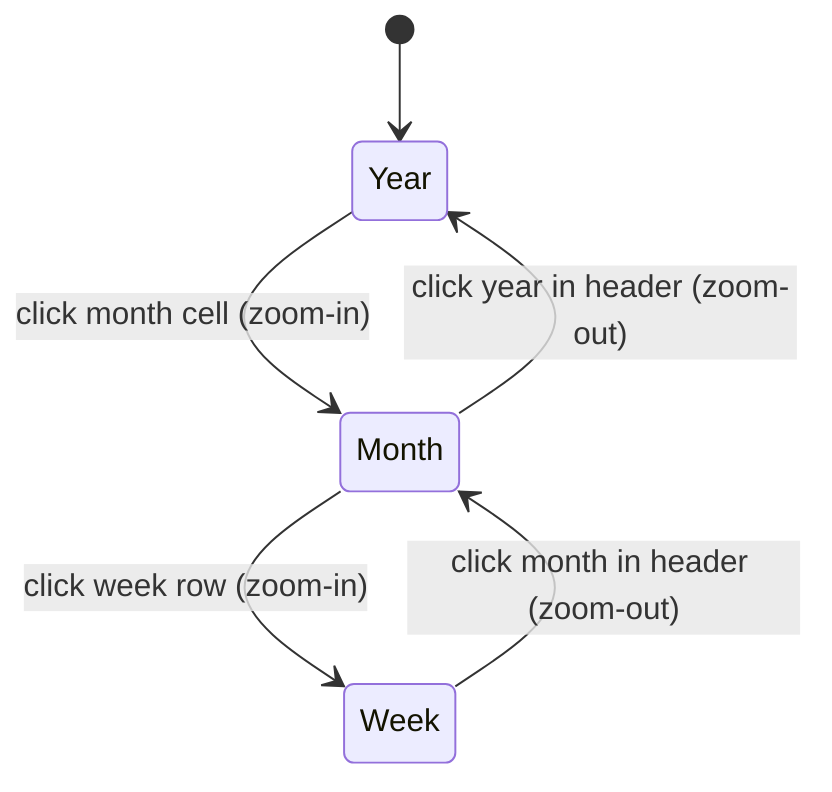

# CalendarPanel

> **Type**: `Component`
> **Status**: `Stable`

Full-screen modal calendar panel with year/month/week tri-view, todo integration, and Chinese lunar calendar metadata.

## Context

- **Problem**: Users need an integrated calendar in the new tab page for date browsing, todo scheduling, countdown events, and time awareness
- **Role**: Primary calendar interface, opened as a modal overlay from the main page
- **Collaborators**: `useTodos` (external todo store, provides todo CRUD), `useCalendarData` (auto-imported composable, provides lunar/festival/solar-term metadata), `useSimpleDrag` (auto-imported, drag-and-drop for todos between dates), `Tooltip` / `TimePicker` (auto-imported UI primitives)

## Architecture

```
CalendarPanel/
├── index.vue                    # Main component: modal overlay, header (year nav + view switcher), view container
├── index.ts                     # Barrel exports
├── types.ts                     # Type definitions (ViewType, CalendarEvent, UserEvent, etc.)
├── components/
│   ├── TimeCapsule.vue          # Time progress bars (today/week/month/year elapsed)
│   ├── TodoItem.vue             # Single todo row: checkbox, text, due-time badge with picker
│   ├── UserEventPanel.vue       # CRUD panel for countdown/anniversary events
│   └── DashboardCards.vue       # Today info card + tabbed upcoming-events/user-events
├── composables/
│   ├── useCalendarPanelState.ts # Core state: provide/inject pattern, view switching, date selection
│   └── useUserEvents.ts         # Singleton composable: user events persisted to localStorage
├── views/
│   ├── YearView.vue             # 12-month mini calendar grid (4 cols) + footer (TimeCapsule + DashboardCards)
│   ├── MonthView.vue            # Full month grid (7×6): lunar dates, holiday tags, todo dots, drag support
│   └── WeekView.vue             # 7-row week view: sidebar (date/lunar) + todo grid, drag support
└── styles/
    └── common.css               # Shared: scrollbar, nav buttons, zoom/fade animations
```

Data flow:

```
index.vue
  │ provide(CalendarStateKey)
  │
  ├─ useCalendarPanelState()
  │    ├─ currentView: 'year' | 'month' | 'week'
  │    ├─ selectedDate, currentYear, currentMonth
  │    ├─ todos (from useTodos)
  │    └─ calendar (from useCalendar)
  │
  ├─ YearView ← inject(CalendarStateKey)
  │    ├─ TimeCapsule (self-contained timer)
  │    └─ DashboardCards → UserEventPanel
  │         └─ useUserEvents() (singleton)
  │
  ├─ MonthView ← inject(CalendarStateKey)
  │    ├─ TodoItem (per todo)
  │    └─ useSimpleDrag (drag todos between dates)
  │
  └─ WeekView ← inject(CalendarStateKey)
       ├─ TodoItem (per todo)
       └─ useSimpleDrag (drag todos between dates)
```

## Interface Schema

### Props

```typescript
interface Props {
  isOpen: boolean  // Controls modal visibility
}
```

| Param | Type | Required | Default | Description |
|-------|------|----------|---------|-------------|
| `isOpen` | `boolean` | ✓ | — | Modal open/close state, v-model binding |

### Emits

```typescript
type Emits = {
  'update:isOpen': [value: boolean]
}
```

### Provide (CalendarStateKey)

```typescript
interface CalendarPanelState {
  currentView: Ref<ViewType>
  selectedDate: Ref<Date>
  isYearMonthOpen: Ref<boolean>
  yearScrollDirection: Ref<'up' | 'down'>
  calendar: ReturnType<typeof useCalendar>
  currentYear: ComputedRef<number>
  currentMonth: ComputedRef<number>
  switchView: (view: ViewType, origin?: { x: number; y: number }) => void
  selectDate: (date: Date) => void
  toggleYearMonth: () => void
  handleYearNav: (delta: number) => void
  goToToday: () => void
  todos: ReturnType<typeof useTodos>
  getTodosByDate: (date: string) => TodoItem[]
}
```

### Key Types

```typescript
type ViewType = 'year' | 'month' | 'week'

interface UserEvent {
  id: string
  title: string
  targetDate: string        // 'YYYY-MM-DD'
  repeat: 'none' | 'yearly'
  pinned: boolean
}

interface TimeCapsuleItem {
  label: string
  passed: number
  total: number
  unit: string
  percent: string
  left: number
}
```

### Sub-Component Interfaces

**TodoItem.vue**

```typescript
interface Props {
  todo: TodoItem    // from @/composables/useTodos
  compact?: boolean // Compact mode: smaller padding, simplified time display
}

type Emits = {
  'update:todo': [todo: TodoItem]
  'drag-start': [event: MouseEvent]
  'delete': []
}
```

**YearView.vue**

```typescript
type Emits = {
  'select-month': [payload: { month: number; target: EventTarget | null }]
}
```

## Constraints

- MUST use `useCalendarState()` (inject helper) in all child components to access shared state — MUST NOT import `useCalendarPanelState()` directly in children
- MUST NOT break the provide/inject chain — `CalendarStateKey` InjectionKey is the single source of truth
- `useUserEvents()` is a module-level singleton — MUST NOT create multiple instances; all callers share the same reactive state
- View transitions MUST use zoom-in (drilling down: year→month→week) and zoom-out (going up: week→month→year) with calculated `transform-origin` from click position
- TodoItem directly mutates `props.todo.done` — this works because todos come from a reactive store (`useTodos`), but MUST NOT be used as a pattern for other props
- `useCalendarData()` and `useSimpleDrag()` are auto-imported — MUST NOT add explicit imports for these
- Holiday preset generation in `useUserEvents` scans 400 days ahead using `COUNTDOWN_FESTIVALS` whitelist — when adding new festivals, MUST update this whitelist

### Error Handling

| Scenario | Condition | Behavior |
|----------|-----------|----------|
| Missing inject | `useCalendarState()` called outside provider | Throws `Error('useCalendarState must be used within CalendarPanel')` |
| Invalid drag | Drag target has no `data-date` attribute | Silently ignored, no state change |
| localStorage parse fail | Corrupted `lime-user-events` data | Falls back to empty array `[]` |

## Logic & Behavior

### View Transition



Transition animation selection:

```
IF targetView.depth > currentView.depth THEN animation = 'zoom-in'
IF targetView.depth < currentView.depth THEN animation = 'zoom-out'
depth: year=0, month=1, week=2
```

### View Switcher Glider

```
gliderStyle.left = activeIndex * buttonWidth
gliderStyle.width = buttonWidth
Transition: CSS transform 0.3s cubic-bezier(0.4, 0, 0.2, 1)
```

### Year Navigation

```
handleYearNav(delta):
  IF delta > 0 THEN yearScrollDirection = 'down'
  IF delta < 0 THEN yearScrollDirection = 'up'
  selectedDate += delta years
```

### Todo Due Status

```
IF dueDate < now THEN status = 'overdue' (red badge)
IF dueDate - now <= 72h THEN status = 'urgent' (yellow badge)
ELSE status = 'normal' (primary color badge)
```

### TimeCapsule Calculation

```
periods = [
  ['今日', hours_passed, 24],
  ['本周', day_of_week (Mon=1..Sun=7), 7],
  ['本月', day_of_month, days_in_month],
  ['本年', days_since_jan1, days_in_year]
]
percent = (passed / total * 100).toFixed(1)
Update interval: 60000ms (1 minute)
```

### UserEvents Sorting

```
sortedItems = items
  .sort(pinned DESC, daysRemaining ASC)
  .where(daysRemaining >= 0 OR repeat == 'yearly')
```

## Dependencies

| Type | Package/Module | Purpose |
|------|---------------|---------|
| Internal | `@/composables/useTodos` | Todo CRUD store (TodoItem type + operations) |
| Internal | `useCalendarData()` | Auto-imported: lunar calendar, festivals, solar terms metadata |
| Internal | `useCalendar()` | Auto-imported: calendar grid generation |
| Internal | `useSimpleDrag()` | Auto-imported: drag-and-drop between date cells |
| Internal | `Tooltip` | Auto-imported: tooltip/popover for time picker |
| Internal | `TimePicker` | Auto-imported: time selection widget |
| External | `vue@^3.2` | Reactivity, provide/inject, transitions |
| External | `dayjs` | Date manipulation (+ weekOfYear, isoWeek plugins) |
| External | `@tabler/icons-vue` | Icon components |
| Storage | `localStorage('lime-user-events')` | UserEvent persistence |

## Patterns

### Basic Usage

```vue
<template>
  <CalendarPanel v-model:isOpen="calendarOpen" />
</template>

<script setup lang="ts">
import { ref } from 'vue'
import { CalendarPanel } from '@/components/CalendarPanel'

const calendarOpen = ref(false)
</script>
```

### Accessing State in Child Components

```typescript
// Inside any component rendered within CalendarPanel
import { useCalendarState } from '@/components/CalendarPanel'

const { currentView, selectedDate, switchView, todos } = useCalendarState()

// Switch to month view with zoom origin
switchView('month', { x: event.clientX, y: event.clientY })
```

### Using UserEvents Composable

```typescript
import { useUserEvents } from '@/components/CalendarPanel'

const { sortedItems, nearest, addItem, removeItem } = useUserEvents()

// Add anniversary
addItem({
  title: '生日',
  targetDate: '2025-06-15',
  repeat: 'yearly',
  pinned: true,
})
```

### TodoItem in Custom Context

```vue
<TodoItem
  :todo="todoItem"
  :compact="true"
  @drag-start="onDragStart"
/>
```

### ❌ Wrong Usage

```typescript
// ❌ Importing useCalendarPanelState in a child — breaks provide/inject contract
import { useCalendarPanelState } from '../composables/useCalendarPanelState'
const state = useCalendarPanelState() // Creates NEW state, not shared

// ✅ Correct: use the inject helper
import { useCalendarState } from '@/components/CalendarPanel'
const state = useCalendarState() // Injects shared state from provider
```

```typescript
// ❌ Creating multiple useUserEvents instances expecting separate state
const events1 = useUserEvents() // singleton
const events2 = useUserEvents() // same instance as events1
```
