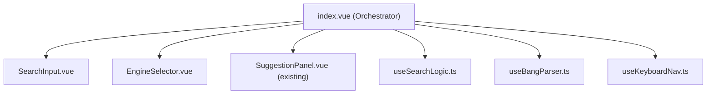

# SearchBar

> **Type**: `Component`
> **Status**: `Stable`
> **Responsibility**: Provide unified search experience with engine switching, Bang syntax, multi-search, suggestion panel, and history management

## Context

- **Problem**: Users need a fast, versatile search entry point in the new tab page that supports multiple search engines, quick switching, and intelligent suggestions
- **Role**: Core interaction hub on the new tab page. Receives user input → resolves search intent → navigates to engine URL
- **Split status**: ✅ Completed (Phase 1 + Phase 2)
- **Collaborators**: `SelectMenu` (engine dropdown), `useDialog` (engine manager modal), `useSettings` (user preferences)

## Architecture

```
SearchBar/
├── index.vue                          # Orchestrator (208 lines)
│   ├── Search state + computed suggestions
│   ├── Style computation
│   └── Composable wiring
├── components/
│   ├── EngineSelector.vue             # Engine dropdown + drag-sort + manager (221 lines)
│   ├── SearchInput.vue                # Input + Bang highlight + shortcut badge (176 lines)
│   ├── EngineManager.vue              # Engine CRUD + drag-sort (682 lines)
│   └── SuggestionPanel.vue            # History + API suggestions display (353 lines)
├── composables/
│   ├── useEngines.ts                  # Engine list management, global singleton (427 lines)
│   ├── useDragSort.ts                 # Pointer-based drag and drop (341 lines)
│   ├── useSearchHistory.ts            # Gravity-scored history with persistence (151 lines)
│   ├── useSuggestions.ts              # Debounced API suggestions with cache (151 lines)
│   ├── useBangParser.ts               # URL detection + Bang syntax parsing (96 lines)
│   ├── useSearchLogic.ts              # 5-level search dispatch (130 lines)
│   ├── useKeyboardNav.ts              # Keyboard shortcuts + panel interaction (136 lines)
│   └── usePanelData.ts               # Suggestion merge + panel state (71 lines)
├── providers/
│   ├── google.ts                      # Google suggestion API
│   ├── baidu.ts                       # Baidu suggestion API
│   ├── bing.ts                        # Bing suggestion API
│   └── index.ts                       # Provider exports
├── types.ts                           # Type definitions
└── index.ts                           # Component export
```

**Data flow** (Props down, Events up):

```
useSettings()  ←── User preferences (width, height, opacity, openInNewTab)
      ↓
index.vue  ←── useEngines() (global singleton: engines, currentEngine, selectEngine)
   │       ←── useSearchHistory() (global singleton: history, addHistory, filteredHistory)
   │       ←── useSuggestions(searchQuery) (debounced API suggestions)
   │
   ↓ props                    ↑ emit
SuggestionPanel.vue     (select, remove, clear, clear-search)

SelectMenu (engine dropdown)  →  handleEngineChange / handleGroupCheck / handleItemCheck
   │
   ↓ dialog.open()
EngineManager.vue  ←── useEngines() (shared singleton)
                   ←── useDragSort() (drag-and-drop reordering)
```

## Interface Schema

### Props / Parameters

No external props. SearchBar is a self-contained widget.

Internal state sourced from:

| Source | Data | Description |
|--------|------|-------------|
| `useSettings()` | `searchBarWidth`, `searchBarHeight`, `searchBarRadius`, `searchBarOpacity`, `searchBarShowIcon`, `searchBarShowEngineTitle`, `generalOpenInNewTab`, `searchSuggestionProvider` | User preferences |
| `useEngines()` | `engines`, `currentEngine`, `selectEngine`, `findEngineByBang`, `checkedEngineIds`, `groupOrder` | Engine management |
| `useSearchHistory()` | `history`, `addHistory`, `removeHistory`, `clearHistory`, `filteredHistory`, `getEntryCount` | History management |
| `useSuggestions(searchQuery)` | `suggestions`, `isLoading`, `clearSuggestions` | API suggestions |

### Key Types

```typescript
interface Engine {
  id: string
  name: string
  url: string           // Template with %s placeholder or append query
  icon: string          // Tabler icon name (e.g. 'IconBrandGoogle')
  builtin?: boolean
  group?: string        // 'search' | 'video' | 'live' | 'shopping' | 'dev' | 'ai'
  bang?: string          // e.g. '!g', '!bd', '!yt'
}

interface SuggestionItem {
  text: string
  source: 'history' | 'suggestion'
  count?: number        // Search frequency (history only)
}

interface HistoryEntry {
  query: string
  count: number
  lastUsed: number      // Timestamp
  engineId?: string
}
```

### Emits

None. SearchBar navigates directly via `window.location.href` or `window.open()`.

## Constraints

**Vue reactivity invariants:**
- MUST NOT mutate props directly
- `useEngines()` and `useSearchHistory()` are global singletons (module-level state)
- MUST use `watchDebounced` for engine persistence (avoid excessive localStorage writes)

**Business rules:**
- Search execution priority: URL direct → Multi-Bang → Single Bang → Ctrl+Enter multi-search → Normal search
- History max: 30 entries, eviction by Gravity score (lowest score removed)
- Suggestion debounce: 300ms, minimum query length: 2 characters
- Suggestion cache: 50 entries, 5-minute TTL
- Multi-search via `chrome.tabs.create` (avoids popup blocker), fallback to `window.open`

**Keyboard shortcuts:**
- `Ctrl+K`: Focus search input (global)
- `Tab`: Cycle through engines
- `Enter`: Search with current engine
- `Ctrl+Enter`: Multi-search with checked engines
- `ArrowUp/Down`: Navigate suggestions
- `Delete/Backspace`: Remove selected history item
- `Escape`: Close panel

## Logic & Behavior

### Search Execution Priority

```
performSearch(query, options):
  1. IF isLikelyUrl(query) → navigateTo(normalizeUrl(query))
  2. IF parseMultiBang(query) → openMultiSearch(engines, parsedQuery)
     Example: "!g+!bd vue3" → search Google AND Baidu
  3. IF parseBang(query) → switch engine + navigateTo(engine.url)
     Example: "!b vue3" → switch to Baidu, search "vue3"
  4. IF options.multi AND checkedEngineIds.size > 0 → openMultiSearch(checkedEngines, query)
  5. ELSE → navigateTo(buildSearchUrl(currentEngine, query))
```

### Bang Syntax

```
Single:  !g vue3        → Google search "vue3"
Multi:   !g+!bd vue3    → Google + Baidu search "vue3"
Prefix:  !g             → Highlights bang tag in input (real-time detection)
```

### Suggestion Merging

```
IF hasKeyword:
  Layer 1: filteredHistory(keyword).slice(0, 3)  → source: 'history'
  Layer 2: apiSuggestions (deduplicated)          → source: 'suggestion'
  Total cap: 8 items
ELSE:
  Full history list (Gravity-sorted)
```

### History Scoring (Hacker News Gravity variant)

```
Score = count / (hoursSinceLastUse + 2) ^ 1.5
```

### Reactivity Strategy

- **Source**: `searchQuery: ref('')`, `isActive: ref(false)`, `selectedIndex: ref(-1)`
- **Derived**: `mergedSuggestions`, `panelSuggestions`, `showPanel`, `activeBang`, `engineOptions` (all `computed`)
- **Effects**: `watch(searchQuery, resetSelectedIndex)`, `onClickOutside(widgetRef, closePanel)`, `onKeyStroke('k', focusInput)`

## Dependencies

| Type | Package/Module | Purpose |
|------|---------------|---------|
| Internal | `@/composables/useSettings` | User preferences |
| Internal | `@/composables/useDialog` | Modal dialog for EngineManager |
| Internal | `@/components/SelectMenu` | Engine dropdown with grid layout |
| External | `vue@^3.2` | Reactivity, computed, watch |
| External | `@vueuse/core` | `useThrottleFn`, `onClickOutside`, `onKeyStroke`, `watchDebounced` |
| External | `@tabler/icons-vue` | 14 engine icons |

## Patterns

### Basic Usage (in App.vue)

```vue
<template>
  <SearchBar />
</template>

<script setup lang="ts">
import SearchBar from '@/components/SearchBar'
</script>
```

### ❌ Anti-Patterns

```vue
<!-- ❌ Passing search config as props (it reads from useSettings singleton) -->
<SearchBar :width="50" :engine="google" />

<!-- ❌ Listening for search events (it navigates directly) -->
<SearchBar @search="handleSearch" />
```

---

## Split Proposal

### Problem Analysis

`index.vue` (911 lines) violates single responsibility. It owns **both** orchestration/state AND substantial UI, and contains 6 distinct functional areas:

| Area | Lines (approx) | Responsibility |
|------|----------------|---------------|
| Engine selection | 37–168 | Engine options computation, checkbox/drag handlers, manager dialog |
| Search state | 169–231 | Query ref, suggestion merging, history integration |
| Style computation | 232–248 | Widget/bar/trigger styles from settings |
| URL + Bang parsing | 249–304 | URL detection, single/multi bang parsing, activeBang computed |
| Search execution | 306–395 | 5-level search dispatch, multi-search, navigation |
| Panel + keyboard | 397–494 | Open/close, focus, keyboard navigation, Ctrl+K shortcut |
| CSS | 584–911 | 330 lines of scoped styles |

### Proposed Split



#### Phase 1: Extract composables from index.vue

| Extract | From | Lines | New File |
|---------|------|-------|----------|
| URL detection + Bang parsing | index.vue:249–304 | ~55 | `composables/useBangParser.ts` |
| Search execution logic | index.vue:306–388 | ~80 | `composables/useSearchLogic.ts` |
| Keyboard navigation | index.vue:416–476 | ~60 | `composables/useKeyboardNav.ts` |

**Impact**: Reduces `index.vue` script section from ~495 lines to ~300 lines. No UI changes needed.

#### Phase 2: Extract UI sub-components

| Extract | From | New File |
|---------|------|----------|
| Search input + Bang highlight + shortcut badge | index.vue template:530–562 | `components/SearchInput.vue` |
| Engine trigger + SelectMenu integration | index.vue template:501–528 | `components/EngineSelector.vue` |

**Impact**: Template section becomes pure composition surface. CSS moves to respective components.

#### Phase 3: Result structure

```
SearchBar/
├── index.vue                    # ~200 lines, pure orchestrator
├── components/
│   ├── SearchInput.vue          # Input + Bang highlight
│   ├── EngineSelector.vue       # Engine trigger + SelectMenu
│   ├── SuggestionPanel.vue      # (existing, unchanged)
│   └── EngineManager.vue        # (existing, unchanged)
├── composables/
│   ├── useEngines.ts            # (existing, unchanged)
│   ├── useDragSort.ts           # (existing, unchanged)
│   ├── useSearchHistory.ts      # (existing, unchanged)
│   ├── useSuggestions.ts        # (existing, unchanged)
│   ├── useBangParser.ts         # NEW: URL detection + Bang syntax
│   ├── useSearchLogic.ts        # NEW: Search dispatch + navigation
│   └── useKeyboardNav.ts        # NEW: Keyboard shortcuts + panel navigation
├── providers/                   # (unchanged)
├── types.ts                     # (unchanged)
└── index.ts                     # (unchanged)
```

### Priority

**Phase 1 (composables) is recommended first** — pure logic extraction, zero UI regression risk, immediately testable with Vitest.
